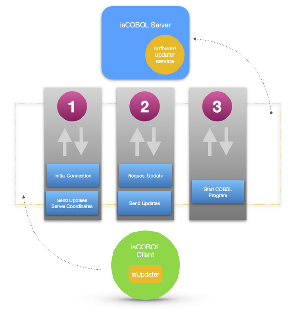

# Automatic Client update

In the isCOBOL Thin Client environment clients can be automatically updated at startup if their version is lower than the runtime version on the server.

If [iscobol.as.clientupdate.site](../is-cobol-evolve/SDK-Users-Guide/Compiler-and-Runtime/Configuration/Configuration-Properties#iscobol-server-thin-client-configuration) is set in the server side configuration, each time a thin client is launched, it looks for updates before starting the COBOL program.

The automatic update process can be skipped by adding the -noupdate option to the client command line.

The automatic update process is described below:

1. The isCOBOL Server sends the URL of the update server as specified by [iscobol.as.clientupdate.site](../is-cobol-evolve/SDK-Users-Guide/Compiler-and-Runtime/Configuration/Configuration-Properties#iscobol-server-thin-client-configuration) to the thin client. This URL can point either to a third party HTTP server or to an isCOBOL Server started with the -hs option, as described in [isCOBOL Server as an HTTP server](../is-cobol-evolve/SDK-Users-Guide/Utilities/ISUPDATER/Server-Configuration#iscobol-server-as-an-http-server). Refer to [Setup of an update server for the isCOBOL SDK](../is-cobol-evolve/SDK-Users-Guide/Utilities/ISUPDATER/Setup-of-an-Update-Server) for information about how to setup an update server for the isCOBOL Thin Client.
2. The thin client runs the [ISUPDATER (Update Facility)](../is-cobol-evolve/SDK-Users-Guide/Utilities/ISUPDATER/Overview) utility to connect to the update server and check for updates. It uses a default configuration built according to the isCOBOL installation directory on the client PC:
  - it sets *swupdater.version.iscobol* to the build number of *lib/iscobol.jar*,
  - it sets *swupdater.directory.iscobol* to the path of the *lib* folder,
  - it sets *swupdater.directory.iscobolJars* to the path of the *jars* folder,
  - it sets *swupdater.directory.iscobolNative* to the location of native libraries (*bin* folder under Windows, *native/lib* folder on other platforms),
  - it also sets *swupdater.directory.clean.iscobol* and *swupdater.directory.clean.iscobolNative* to true in order to ensure a clean installation of the updated items.

**Note** - It is possible to customize the above configuration by putting a *isupdater.properties* configuration file in the client side Classpath or using the -uc option in the Client command line. See [Client Configuration (isupdater.properties)](../is-cobol-evolve/SDK-Users-Guide/Compiler-and-Runtime/Configuration/Configuration-Properties#client-configuration-isupdaterproperties) for more information about the possible configuration entries.

After it:
  - if the server is down or no update is necessary, the thin client execution continues normally,
  - if some updates were executed, the thin client is automatically restarted with the *-noupdate* option.

The need of updating is determined by comparing the build numbers specified by the swupdater.version properties used by the client with the build numbers specified by the *swupdater.version* properties in the swupdater.properties file on the server.

**Note** - the automatic client update works smoothly only when server and client have the same operating system and bitness (i.e. if they’re both Windows 64-bit). If the operating system or bitness is different, then you need to set up the update process as explained at [Distributon of the thin client](../is-cobol-evolve/SDK-Users-Guide/Utilities/ISUPDATER/Distribution-of-the-Thin-Client).
