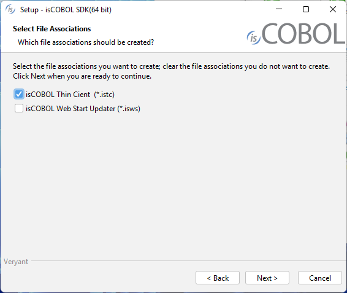

## Deployment through automatic client update and istc files

The information in this chapter is applicable to thin client environments where the client machines are Windows.

To deploy the application through the [Automatic Client update](../../Automatic-Client-update) feature of isCOBOL Server, the isCOBOL Client must be installed on the client machines.

Install either isCOBOL_*yyyy_R_n*_Windows_*arc.msi* (it requires Java installed on the machine) or isCOBOL_*yyyy_R_n*_THIN_Windows_*arc.msi* (it doesn’t require Java on the machine as it installs its own JVM) where where yyyy is the year, *R* is the release number, *n* is the build number and *arc* is the system architecture.

When prompted, choose to associate the istc extension to the isCOBOL Client:



The istc files are property files that include the isCOBOL configuration entries that you would use client side in order to instruct the isCOBOL Client about the server location, the remote configuration file and the main program as well as custom entries that are inquired by the client side logic of the COBOL application. These files could be passed to isCOBOL Client via the -lc option. The installer creates an association between the istc extension and the command:

```cobol
isclient -lc %1
```

Below we describe how to set up the deployment through automatic client update and istc files:

1. Configure the update server as described in [Setup of an update server for the isCOBOL SDK](../../../is-cobol-evolve/SDK-Users-Guide/Utilities/ISUPDATER/Setup-of-an-Update-Server).
2. Start the isCOBOL Server pointing to your update server via the [iscobol.as.clientupdate.site](../../../is-cobol-evolve/SDK-Users-Guide/Compiler-and-Runtime/Configuration/Configuration-Properties#iscobol-server-thin-client-configuration) configuration property, e.g.

```cobol
iscobol.as.clientupdate.site=updateServerNameOrIp:10996
```

Where *updateServerNameOrIp* is the server name or IP address where the update server is listening and *10996* is the update server port. *updateServerNameOrIp* may match with the isCOBOL Server’s name or IP address if you started both the application server and the update server in the same isCOBOL Server process as described in [isCOBOL Server as an HTTP server](../../../is-cobol-evolve/SDK-Users-Guide/Utilities/ISUPDATER/Server-Configuration#iscobol-server-as-an-http-server).

3. create a file with istc extension, e.g. myapp.istc and put the following entries into it:

```cobol
iscobol.hostname=serverNameOrIp
iscobol.port=10999
iscobol.default_program=MYPROG
```

Where *serverNameOrIp* and 10999 are the server name or IP address and the port where the isCOBOL Server started in step 2 is listening and MYPROG is the name of the program that you wish to execute. The class of this program must be found either in the server’s Classpath or in the server side [iscobol.code_prefix](../../../is-cobol-evolve/SDK-Users-Guide/Compiler-and-Runtime/Configuration/Configuration-Properties#general-runtime-configuration) setting.

Double clicking on *myapp.istc* will trigger the program execution. It also will update the local copy of the isCOBOL runtime if necessary.

Double clicking on a istc file is equivalent of running the isCOBOL Client with the option –lc that points to the istc file. So, if you’re replacing a isCOBOL Client command, and you used the –lc option in your original command, then you should include all the entries of the file pointed by –lc into the new istc file.

The file *myapp.istc* could be distributed via internet in the form of a file to be downloaded and executed. See [Configuring the istc and isws extensions in Apache HTTP Server](./Configuring-the-istc-and-isws-extensions-in-Apache-HTTP-Server) for more information.
