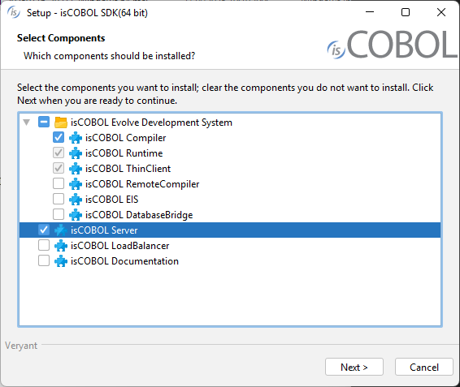
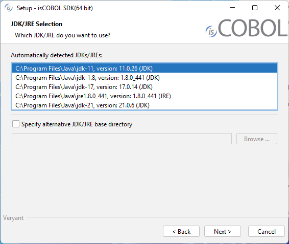
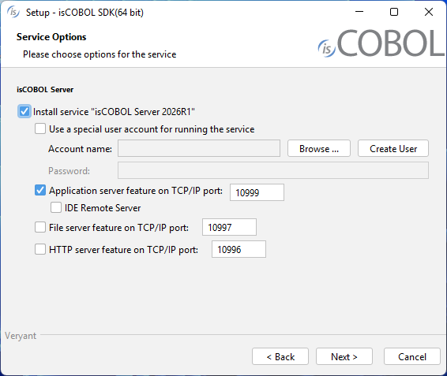

## Download and install isCOBOL Evolve SDK

### Windows

1. If you haven't already done so, [Download and install Java (JDK or JRE)](./Download-and-install-Java).
2. Go to "[https://support.veryant.com](https://support.veryant.com)".
3. Sign in with your User ID and Password.
4. Click on the "Download Current Release" link.
5. Scroll down to the list of files for Windows x64 64-bit. Select isCOBOL_2026_R1_*n*_Windows.64.msi, where *n* is the build number.

**Note** - A setup for Windows 32-bit is available on demand. Contact Veryant if you need it.

6. Run the downloaded installer to install the files.

**Note** - If your Windows has the option "Run as Administrator", you should run the setup with that option, otherwise the setting of environment variables might silently fail. Environment variables setting is not necessary if you work from the isCOBOL Shell (explained later).

7. Select "isCOBOL Server" from the list of products when prompted.



8. Select your JDK/JRE when prompted



9. Follow the wizard procedure to the end. In the process you will be asked to provide the installation path ("C:\\Veryant" by default) and license keys. You can skip license activation and perform it later, as explained in [Activate the License](./Activate-the-License).

10. You will also be asked if you want to install the Application Server as a system service or not. If you don’t install the service, you will have to start the Application Server in foreground mode from a command prompt as explained in [Usage of isCOBOL Server](../Usage-of-isCOBOL-Server/Usage-of-isCOBOL-Server). See [Windows service and Unix daemon](../Windows-service-and-Unix-daemon/Windows-service/Windows-Service) for details about the system service.



#### Quiet mode

The isCOBOL SDK setup supports the msi quiet mode. Settings can be driven with a response file.

A response file is a text file with name-value pairs that represent installer variables.

A response file is generated automatically after an installation is finished. The generated response file is found in the *.install4j* directory of the isCOBOL SDK and is named *response.varfile*.

When an installer is executed, it checks whether a file with the same name and the *.varfile* extension can be found in the same directory and loads that file as the response file. For example, if an installer is named *foo_setup.msi* on Windows, the response file next to it has to be named *foo_setup.varfile*.

For more information about msi setups and their command line options, see [Microsoft Standard Installer Command-Line Options](https://docs.microsoft.com/en-us/windows/win32/msi/standard-installer-command-line-options).

### Linux and Mac OSX

1. If you haven't already done so, [Download and install Java (JDK or JRE)](./Download-and-install-Java).
2. Go to "[https://support.veryant.com](https://support.veryant.com)".
3. Sign in with your User ID and Password.
4. Click on the "Download Current Release" link.
5. Scroll down, and select the appropriate .tar.gz file for the product and platform you require.
6. Extract all contents of the archive. For example,

on Linux 64 bit:

```cobol
gunzip isCOBOL_2026_R1_*_Linux.64.x86_64.tar.gz
tar -xvf isCOBOL_2026_R1_*_Linux.64.x86_64.tar
```

on Mac OSX:

```cobol
gunzip isCOBOL_2026_R1_*_MacOSX.64.x86_64.tar.gz
tar -xvf isCOBOL_2026_R1_*_MacOSX.64.x86_64.tar
```

7. Change to the "isCOBOL2026R1" folder and run "./setup", you will obtain the following output:

```cobol
===============================================================================
 
                           isCOBOL EVOLVE Installation
                           For isCOBOL Release 2026R1
                        Copyright (c) 2005 - 2026 Veryant
 
===============================================================================
 
Install Components:
 
    [0] All products...................................... (no)
    [1] isCOBOL Compiler (includes [2] & [3])............. (yes)
    [2] isCOBOL Runtime (includes [3]).................... (no)
    [3] isCOBOL ThinClient................................ (no)
    [4] isCOBOL RemoteCompiler............................ (no)
    [5] isCOBOL EIS....................................... (no)
    [6] isCOBOL DatabaseBridge............................ (no)
    [7] isCOBOL Server.................................... (no)
    [8] isCOBOL LoadBalancer.............................. (no)
 
Install Path:
    [P] isCOBOL parent directory: UserHome/veryant
 
JDK Path:
    [J] JDK install directory: JavaHome
 
[S] Start Install        [Q] Quit
 
==============================================================================
Please press [ 1 2 3 4 5 6 7 8 P J S Q ] 
```

8. Type "7", then press Enter to select isCOBOL Server.
9. (optional) Type "P", then press Enter to provide a custom installation path, if you don’t want to keep the default one.
10. Type "S", then press Enter to start the installation.

**Note** - if the setup script is not available for your Unix platform or you don’t want to use it, just extract the tgz content to the folder where you want isCOBOL to be installed.

isCOBOL Evolve for UNIX/Linux provides shell scripts in the isCOBOL "bin" directory for compiling, running, and debugging programs. These scripts make use of two environment variables, ISCOBOL to locate the isCOBOL installation directory and ISCOBOL_JDK_ROOT to locate the JDK installation directory. To use these scripts set these environment variables and add the isCOBOL "bin" directory to your PATH.

For example, if you install isCOBOL in "/opt/isCOBOL" and your JDK is in "/opt/java/jdk1.8.0":

```cobol
export ISCOBOL=/opt/isCOBOL
export ISCOBOL_JDK_ROOT=/opt/java/jdk1.8.0
export PATH=$ISCOBOL/bin:$PATH
```

### Other Unix

A dedicated setup is provided for Linux 64 bit and Mac OSX 64 bit.

If you need to install isCOBOL on another Unix platform, you can contact Veryant to verify if the desired porting is available on demand, or you can use the platform independent setup.

This setup includes only the cross platform items while it lacks native items. Contact Veryant if you need the porting of a native item to your Unix platform.

Instructions for the installation of the platform independent setup are provided below.

1. If you haven't already done so, [Download and install Java (JDK or JRE)](./Download-and-install-Java).
2. Go to "[https://support.veryant.com](https://support.veryant.com)".
3. Sign in with your User ID and Password.
4. Click on the "Download Current Release" link.
5. Scroll down to the "Platform Independent" section and select isCOBOL_2026_R1_n_noarch.tar.gz, where n is the build number.

Extract all contents of the archive:

```cobol
gunzip isCOBOL_2026_R1_*_noarch.tar.gz
tar -xvf isCOBOL_2026_R1_*_noarch.tar
```

### Distribution Files

For information on a specific distribution file, please see the README file installed with the product.
