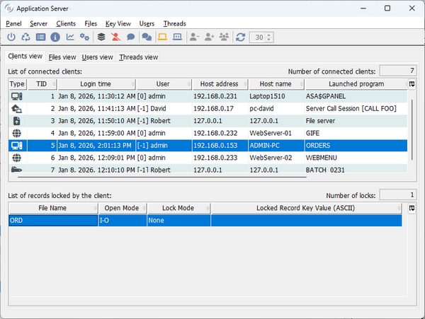

# Internal lock management

isCOBOL Server allows locks on indexed files to be managed internally, without demanding the lock request to the file handler. In order to activate this feature, the following setting must appear in the server configuration:

```cobol
iscobol.file.lock_manager=com.iscobol.as.locking.InternalLockManager
```

isCOBOL Server can be either a iscserver process running as Application Server, a iscserver process running as File Server or a iscserver process running as both. In the third case, locks acquired by the Application Server clients are managed together with locks acquired by the File Server clients.

Note - For this feature to work correctly, the configuration property [iscobol.as.multitasking](../is-cobol-evolve/SDK-Users-Guide/Compiler-and-Runtime/Configuration/Configuration-Properties#iscobol-server-thin-client-configuration) must be either omitted or set to 0.

Making isCOBOL Server manage locks itself guarantees that all the lock clauses are supported, regardless of the file handler; this is particularly useful when working on databases via DatabaseBridge. Active locks can be monitored and managed through the server administration panel:

```cobol
iscclient [-port port] [-hostname host] -panel
```



There are two disadvantages in using this feature:

- locks are held only between the clients of the same isCOBOL Server and don’t affect COBOL programs running outside of the isCOBOL Server as well as third party applications;
- since network requests are serialized, you might experience a performance slowdown when there are several clients connected.

In conclusion, this feature should be taken into account only:

- when the file handler is Database Bridge (easydb), as it doesn’t support all the lock possibilities, or
- for small thin client environments with few clients connected.
