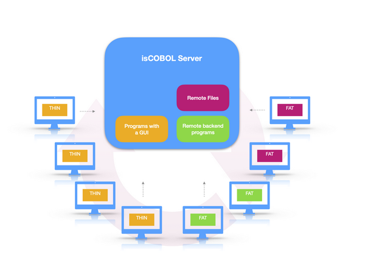

# Overview

isCOBOL programs can run locally or be distributed from a server with isCOBOL Application Server, simplifying distribution steps and improving time-to-market for key applications. With isCOBOL Server, applications are easily distributed to take full advantage of today’s multi-threaded processing capabilities on a variety of platforms including UNIX, Linux and Windows.

For information on how to move from a stand-alone/fat-client environment to a thin-client environment, see [Moving from Fat Client to Thin Client](../is-cobol-evolve/SDK-Users-Guide/Programming-Guides/Moving-from-Fat-client-to-Thin-Client).
