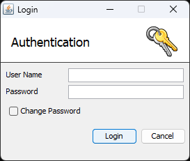

## Login

A login is usually only required when a client connects to the Application Server to launch an administrative routine (such as -panel, -info, -kill, or -admin) or a utility. If the property [iscobol.as.authentication \*](../../is-cobol-evolve/SDK-Users-Guide/Compiler-and-Runtime/Configuration/Configuration-Properties#iscobol-server-thin-client-configuration) is set to “2” on the server side, a login is always required when the client connects.

The user credentials can be passed on the Client command line through the options -user and -password. Alternatively they can be set in the Client configuration through the properties [iscobol.user.name](../../is-cobol-evolve/SDK-Users-Guide/Compiler-and-Runtime/Configuration/Configuration-Properties#iscobol-server-thin-client-configuration) and [iscobol.user.password](../../is-cobol-evolve/SDK-Users-Guide/Compiler-and-Runtime/Configuration/Configuration-Properties#iscobol-server-thin-client-configuration).

If user credentials were not provided at Client startup, the Client prompts the user to input them. On systems where a graphical desktop is not available, the credentials are accepted on the command line. On systems where a graphical desktop is available instead, the following dialog is shown:



The default Administrator credentials are:

User Name = ‘admin’

Password = ‘admin’

You can change them by launching the Client with the -admin option.

By default user credentials are stored in a file named *password.properties* in the server working directory. You can change the name and location of this file by setting the configuration property [iscobol.as.password_file](../../is-cobol-evolve/SDK-Users-Guide/Compiler-and-Runtime/Configuration/Configuration-Properties#iscobol-server-thin-client-configuration).

**Note** - On Linux/Unix, in order to encrypt passwords, Java access to /dev/random, a special file that serves as a random number generator. It allows access to environmental noise collected from device drivers and other sources. The bits of noise are stored in a pool. When the pool is empty, reads from /dev/random will block until additional environmental noise is gathered. A counterpart to /dev/random is /dev/urandom which reuses the internal pool to produce more pseudo-random bits. This means that the call will not block, but the output may contain less entropy than the corresponding read from /dev/random.

If your client needs too much time to connect when the authentication is required, you might consider to instruct Java to use /dev/urandom instead of /dev/random, by adding the following option to the Application Server startup command-line:

```cobol
-Djava.security.egd=file:///dev/urandom
```

### Custom Login

isCOBOL offers the ability to create a custom login, which displays a custom window or no window at all. Before showing the default login window, the Application Server calls A$CUSTOM_LOGIN on the client machine. If this program is found, it is used instead of the default.

This program must be called A$CUSTOM_LOGIN, must be reachable in the client CLASSPATH, and must use the following linkage code.

```cobol
----
LINKAGE SECTION.
 
  77 login-user pic n any length.
  77 random-value pic x any length.
  77 password-hashed-hash pic x any length.
  77 new-password-crypted-hash pic x any length.
  77 flags pic 9.
  77 new-password-min-length pic 99.
----
```

The following table describes the parameters for the linkage code:

| Parameter | Description |
| --- | --- |
| login-user (output parameter) | Returns the username for the login. |
| random-value (input parameter) | Use this value to obtain the digest of the password. |
| password-hashed-hash (output parameter) | Returns a hashed password. |
| new-password-crypted-hash (output parameter) | Returns the encrypted hash of the new password, or spaces if the password is unchanged. |
| flags (optional input parameter) | May contain one of the following values:<br>0 => password change optional (default)<br>1 => password change mandatory<br>2 => check password weakness |
| new-password-min-length (optional input parameter) | Contains the minimum length of the password, use this value to check your password before returning it. |

The program returns “0” if the login has been confirmed, or “-1” if the login has been cancelled.

An example of a custom login GUI is installed with isCOBOL. You can find it in the folder $ISCOBOL_HOME/sample/as/custom-login.

**Note** - The custom login program is called only in replacement of the standard login dialog. If user credentials were passed on the command line or set in the configuration, then the custom login program is not called.
