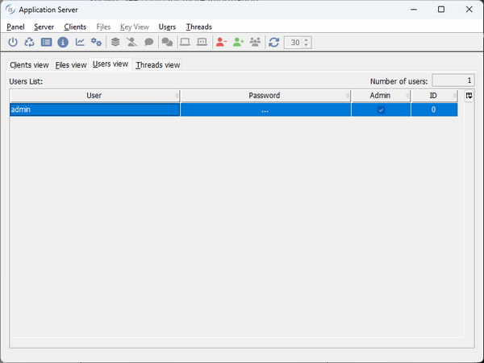
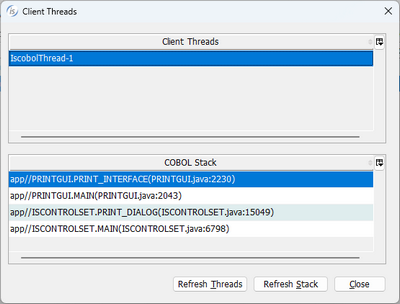
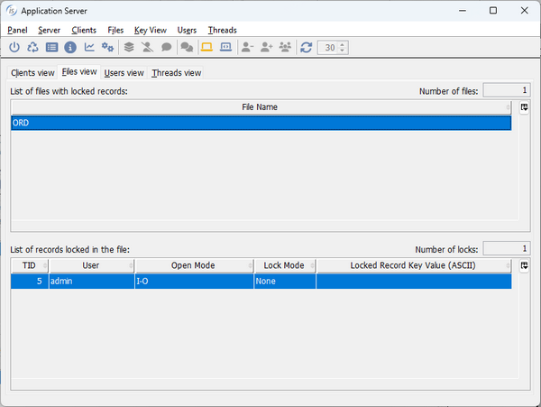
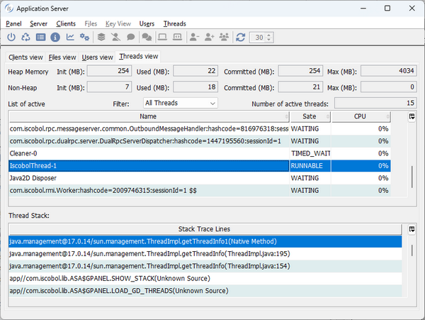
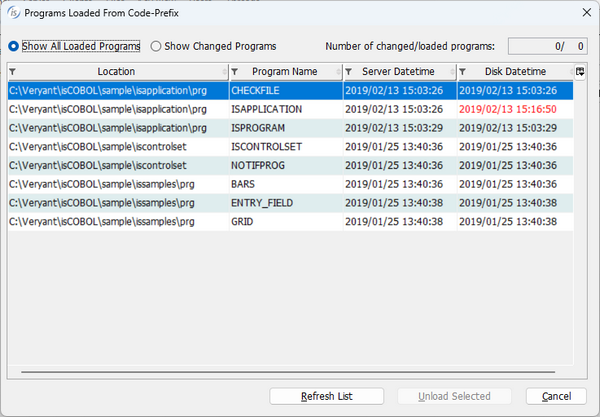
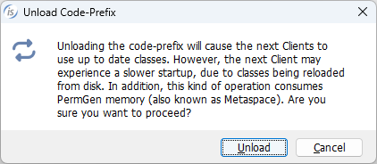

# Usage of isCOBOL Client

## Format 1

To execute a program, use the following command:

```cobol
iscclient [--system | --metal | --flatlaf lafname | --GTK | --nimbus] [-port port] [-hostname host] [-c remote-config] [-lc local-config] [-uc updater-config][-nodisconnecterr] [-noupdate][-timeout s] program [ arg1 [arg2] ... ]
```

where:

- *--system, --metal, --flatlaf, --GTK, and --nimbus* specify the look and feel for the GUI screen displayed on the client side.

| | |
| --- | --- |
| *--system*é | current system Look and Feel |
| *--metal* | Metal Look and Feel |
| *--flatlaf* | Flatlaf Look and Feel.<br>It must be followed by one of these values:<br>- FlatDarculaLaf<br>- FlatDarkLaf<br>- FlatIntelliJLaf<br>- FlatLightLaf <br><br>Note - an invalid value will cause the Metal Look and Feel to be used instead of the FlatLaf Look and Feel |
| *--GTK* | GTK Look and Feel; not available on Windows |
| *--nimbus* | Nimbus Look and Feel |
| | |

If none of these options is used, then the --system is assumed.

- *port* is the port number the server is listening to.
- *host* is the host machine where the server is running.

*port* and *host* can specify multiple values separated by comma. See [Specifying multiple hostnames and ports](./Usage-of-isCOBOL-Client#specifying-multiple-hostnames-and-ports) for details.

- *remote-config* is the configuration file that the client should use. This file is loaded server-side and its entries are appended to the configuration file used to start the isCOBOL Application Server. This option allows you to have different configurations for different clients.
- *local-config* is the configuration file that hosts client-side settings, for example configuration properties for programs called through the CALL CLIENT statement.
- *updater-config* is a custom configuration file to be passed to the isUpdater that is automatically invoked by the isCOBOL Client at startup unless the -noupdate option is used. If the -uc option is not used, then the isCOBOL Client looks for a file named isupdater.properties in Classpath.
- *-nodisconnecterr*, if used, avoids a notification message box to appear when the connection between client and server is lost. This option should always be used when a X Window System (X11) is not available on the client. This option is automatically set by the kill command described in Format 3.
- *-noupdate*, if used, makes the client avoid looking for updates before starting.
- s is the connection timeout expressed in seconds. If the *-timeout* option is not used, the default connection timeout in the system is used.
- *program* is the program to be executed. It must be a standard COBOL program with PROGRAM-ID. Paths are not allowed in this parameter. Paths in the program name are allowed when using aliases; see [Working with Aliases](../Working-with-Aliases) for more information.
- *arg1* and *arg2* are the arguments passed to the program.

## Format 2

To show information about an Application Server module, use the following command:

```cobol
iscclient [-port port] [-hostname host] [-user usr] [-password pwd] -info
```

where:

- *port* is the port number the server is listening to.
- *host* is the host machine where the server is running.
- *port* and *host* can specify multiple values separated by comma. See [Specifying multiple hostnames and ports](./Usage-of-isCOBOL-Client#specifying-multiple-hostnames-and-ports) for details.
- *usr* and *pwd* are the administrator user credentials, that are necessary to access the administration panel under the default configuration. If not passed, then a login prompt will be shown. See [Login](./Login) for more information.

## Format 3

To kill a thread running on the specified server, use the following command:

```cobol
iscclient [-port port] [-hostname host] [-user usr] [-password pwd] -kill {threadID }
                                                                          {AS       }
```

where:

- *port* is the port number the server is listening to.
- *host* is the host machine where the server is running.
- *port* and *host* can specify multiple values separated by comma. See [Specifying multiple hostnames and ports](./Usage-of-isCOBOL-Client#specifying-multiple-hostnames-and-ports) for details.
- *usr* and *pwd* are the administrator user credentials, that are necessary to access the administration panel under the default configuration. If not passed, then a login prompt will be shown. See [Login](./Login) for more information.
- *threadID* is the ID of thread to be killed. (Use the -info option to return a list of currently running threads).
- *AS* (an alternate parameter of threadID) indicates that the Application Server should stop. All alive clients are automatically disconnected when the Application Server stops.

## Format 4

To open a window in which users can be managed, use the following command:

```cobol
iscclient [-port port] [-hostname host] [-user usr] [-password pwd] -admin
```

where:

- *port* is the port number the server is listening to.
- *host* is the host machine where the server is running.

*port* and *host* can specify multiple values separated by comma. See [Specifying multiple hostnames and ports](./Usage-of-isCOBOL-Client#specifying-multiple-hostnames-and-ports) for details.

- *usr* and *pwd* are the administrator user credentials, that are necessary to access the administration panel under the default configuration. If not passed, then a login prompt will be shown. See [Login](./Login) for more information.



A row for each registered user is shown. Columns have the following meaning:

| | |
| --- | --- |
| User | User name |
| Password | User password |
| Admin | User privileges. It can be *Admin* or not. |
| ID | User ID. Admin users have ID=0. |
| | |

Tool-bar buttons and menu items allow you to

- Add a new user
- Delete an existing user
- Force the garbage collector on the server JVM
- Shut down the Application Server

The table where users are listed is editable. Double click in the cells in order to edit their value.

## Format 5

To open a window in which client sessions are managed, use the following command. The administrator can see a list of connected clients, kill clients, and even shutdown the Application Server.

```cobol
iscclient [-port port] [-hostname host] [-user usr] [-password pwd] -panel
```

where:

- *port* is the port number the server is listening to.
- *host* is the host machine where the server is running.

*port* and *host* can specify multiple values separated by comma. See [Specifying multiple hostnames and ports](./Usage-of-isCOBOL-Client#specifying-multiple-hostnames-and-ports) for details.

- *usr* and *pwd* are the administrator user credentials, that are necessary to access the administration panel under the default configuration. If not passed, then a login prompt will be shown. See [Login](./Login) for more information.

The standard dialog that appears with this command looks like this:


A row for each connected client (including the client you used to start the panel) is shown. Columns have the following meaning:

| | |
| --- | --- |
| Type | The icon specifies the client type: |
|  |  Standard thin client |
|  |  Web client |
|  |  Remote call |
|  |  File server client |
|  |  TurboRun session |
| | Leave the mouse pointer over the icon to display a tool-tip with additional information. The tool-tip will tell if the client is running as a separate process or not, due to the [iscobol.as.multitasking](../../is-cobol-evolve/SDK-Users-Guide/Compiler-and-Runtime/Configuration/Configuration-Properties#iscobol-code-coverage-configuration) setting. |
| TID | Thread ID of the client |
| Login time | Date and time the client session was started. The date and time are represented using the locale of the current PC, where the panel user interface is displayed |
| User | User name. The number between square brackets is the ID specified in the user administration panel (see [Format 4](./Usage-of-isCOBOL-Client#format-4)). A value of -1 means that the user has not been registered using the administration panel. In this case the operating system user name is shown |
| Host address | IP address of the client PC |
| Host name | Host name of the client PC. If the host name can’t be retrieved, the IP address is shown |
| Launched program | Program name passed in the client command-line or the last program called through CHAIN statement. <br><br>The special value "File server" identifies a connection to the [isCOBOL File Server](../isCOBOL-File-Server/isCOBOL-File-Server). This kind of connection cannot be killed from the panel, it terminates along with the runtime sessions that opened the remote files. <br><br>The special value "Server Call Session" identifies a remote call. See [Remote objects](../Remote-objects) for details. The text between square brackets tells the name of the program that was remotely called. The word "Waiting" means that the last remote program terminated and the server is waiting for the client to execute a new remote program. This kind of connection cannot be killed from the panel, it terminates along with the runtime sessions that performed the remote calls. |
| User information | Custom information stored by calling [A$USERINFO](\) |
| | |

Tool-bar buttons and menu items allow you to

- Shut down the Application Server
- Force the garbage collector on the server JVM
- List loaded programs and unload them (see [Unloading programs](../Usage-of-isCOBOL-Client/Usage-of-isCOBOL-Client#unloading-programs) below for more information)
- Show server settings
- Collect heap and thread dumps of the server JVM
- Kill client connections
- Notify client connections with a message\[1\]
- Show the current threads stacktrace, if available\[2\]
- Refresh the list of connected clients

\[1\]The message appears in the form of a standard graphical message box by default. It’s possible to customize this message as explained at [Customizing the message layout](\).

\[2\]If the "Show Stack" option is enabled, click on it or press Enter in order to show a dialog that lists the COBOL threads started by that Client. For every thread you can see the stack.The screenshot below shows the info dialog generated for the isCOBOL Demo running in thin client while it was printing. You can see from the stack that the runtime is executing the paragraph ST_ADDRESS in PRINTPROG called by ISCONTROLSET:



The stack information is not available for File Server clients, isCOBOL Utilities, TurboRun sessions and clients running in a separate JVM due to the [iscobol.as.multitasking](../../is-cobol-evolve/SDK-Users-Guide/Compiler-and-Runtime/Configuration/Configuration-Properties#iscobol-server-thin-client-configuration) setting.

If [iscobol.file.lock_manager \*](../../is-cobol-evolve/SDK-Users-Guide/Compiler-and-Runtime/Configuration/Configuration-Properties#file-handling-configuration) is set in the server configuration, then the panel dialog looks more complex:


A row for each record locked by the selected client is shown in the second table. Columns have the following meaning:

| | |
| --- | --- |
| File Name | Name of the archive where the lock is found |
| Open Mode | Open mode of the archive where the lock is found |
| Lock Mode | Lock mode of the archive where the lock is found |
| Locked Record Key Value | Value of the locked record primary key |
| | |

The *File View* page looks like this:



A row for each file with locks is shown at the top. The table below is populated with details about the locked records in the selected file. Columns have the following meaning:

| | |
| --- | --- |
| TID | Thread ID of the client that is holding the lock |
| User | User name used by the client to log in the Application Server. |
| Open Mode | Open mode used by the client program |
| Lock Mode | Lock mode used by the client program |
| Locked Record Key Value | Value of the locked record primary key |
| | |

The additional tool-bar buttons and menu items allow you to

- Refresh the list of active locks
- Switch between ASCII and hexadecimal visualization of the key value

The *Threads* view page shows the list of all the active threads running in the Application Server. For every thread you can see the status, the CPU usage and the stack. It’s possible to filter the list in order to see only the COBOL programs threads. It’s also possible to terminate a thread, despite this operation is not suggested and should be performed only in critical situations where a thread cannot be terminated in a clean way.



The “Auto refresh” check box in the tool-bar allows you to automatically refresh the lists. The refresh is performed every 30 seconds by default, but the time can be changed using the spinner field or by setting the configuration property [iscobol.as.panel.refresh_timeout \*](../../is-cobol-evolve/SDK-Users-Guide/Compiler-and-Runtime/Configuration/Configuration-Properties#iscobol-server-thin-client-configuration).

### Unloading programs

The rules behind class loading depends on the [iscobol.code_prefix.reload \*](../../is-cobol-evolve/SDK-Users-Guide/Compiler-and-Runtime/Configuration/Configuration-Properties#general-runtime-configuration) setting.

| iscobol.code_prefix.reload value | Icon on the tool-bar | Item under Server menu |
| --- | --- | --- |
| 0 |  | Loaded Programs |
| 1 |   | Loaded Programs |
| 2 |   | Unload Code-Prefix |

Clicking on *Server* in the menu bar and choosing *Loaded Programs* or clicking the corresponding tool-bar button, the following dialog appears:



The table lists all the programs loaded from the paths specified by [iscobol.code_prefix](../../is-cobol-evolve/SDK-Users-Guide/Compiler-and-Runtime/Configuration/Configuration-Properties#general-runtime-configuration).

If the property [iscobol.code_prefix.reload \*](../../is-cobol-evolve/SDK-Users-Guide/Compiler-and-Runtime/Configuration/Configuration-Properties#general-runtime-configuration) is set to 0, then it’s possible to unload the program classes. Select the desired programs by clicking on the corresponding row (hold Ctrl to select multiple rows) then click the button *Unload Selected*. Once a program has been unloaded, the isCOBOL Server will re-load the class from disk the next time this program is called. This feature is useful to update COBOL programs while the isCOBOL Server is running.

*Server Datetime* holds the last modification timestamp of the class file at the time it was loaded by isCOBOL Server. *Disk Datetime* holds the current last modification timestamp of the class file. If *Disk Datetime* is more recent than *Server Datetime*, a red color is used to highlight that this program has been modified. Programs with a red *Disk Datetime* are suitable to be unloaded. You can activate the *Show Changed Programs* option in order to filter the table content and see only the modified programs.

Programs loaded from the Classpath are not shown in this dialog and can’t be unloaded.

Clicking on Server in the menu bar and choosing *Unload Code-Prefix* or clicking the corresponding tool-bar button, the following prompt appears:



By clicking the Unload button, all program classes are unloaded and the next Client will reload them.

### Collecting dumps

You can collect heap and thread dumps of the server JVM by using clicking the heap buttons on the tool-bar or by using the corresponding item under the Server menu.

| Icon on the tool-bar | Item under Server menu |
| --- | --- |
|  | Heap Dump |
|  | Thread Dump |

Dump files are saved in the isCOBOL Server’s working directory.

Once a dump has been collected, the Panel will inform you about the exact pathname of the dump file through a message box.

**Note** - Use the Heap Dump feature carefully, as memory dump files may use a lot of disk space, depending on how much memory is being used by the isCOBOL Server at the moment the dump is collected.

## Format 6

To debug a remote application from a client pc, use the following command.

```cobol
iscclient [-debugport dport] [-port port] [-hostname host] [-c remote-config] [-lc local-config] -d program [ arg1 [arg2] ... ]
```

where:

- *port, host, remote-config, local-config, program, arg1 and arg2* are the same as in Format 1

*port* and *host* can specify multiple values separated by comma. See [Specifying multiple hostnames and ports](./Usage-of-isCOBOL-Client#specifying-multiple-hostnames-and-ports) for details.

- *dport* is the port on which the Remote Debugger will listen for connections. There is no need to define this port in the server side configuration as iscclient takes care of informing the isCOBOL Server that a Debugger will connect on that specific port, and the isCOBOL Server opens the port automatically.

If the -debugport option is omitted and [iscobol.as.multitasking](../../is-cobol-evolve/SDK-Users-Guide/Compiler-and-Runtime/Configuration/Configuration-Properties#iscobol-server-thin-client-configuration) is set either to 1 or 2, then the Debugger will connect to the first available port in the range specififed by [iscobol.as.debugport_range](../../is-cobol-evolve/SDK-Users-Guide/Compiler-and-Runtime/Configuration/Configuration-Properties#iscobol-server-thin-client-configuration) in the isCOBOL Server’s configuration.

### Concurrency with other connected Clients

By default, during a debug session other client connections are blocked. Set [iscobol.as.multitasking](../../is-cobol-evolve/SDK-Users-Guide/Compiler-and-Runtime/Configuration/Configuration-Properties#iscobol-server-thin-client-configuration) to 2 in the isCOBOL Server’s configuration in order to avoid it.

## Format 7

To run a utility in thin client mode, use the following command:

```cobol
iscclient -hostname 192.168.0.101 -utility ismigrate
```

where:

- *port* is the port number the server is listening to.
- *host* is the host machine where the server is running.

*port* and *host* can specify multiple values separated by comma. See [Specifying multiple hostnames and ports](./Usage-of-isCOBOL-Client#specifying-multiple-hostnames-and-ports) for details.

- *usr* and *pwd* are the administrator user credentials, that are necessary to access the administration panel under the default configuration. If not passed, then a login prompt will be shown. See [Login](./Login) for more information.
- *utility_name* can be any of the following (case insensitive):
  - cobfileio
  - cpk
  - gife
  - isl
  - ismigrate
  - jdbc2fd
  - jutil
  - xml2wrk

A possible scenario in which this command makes sense is if you have some indexed files stored on a Linux/Unix server machine without desktop and you wish to manage them with GIFE or convert them with ISMIGRATE having the utility GUI displayed on your Windows client PC. E.g.

```cobol
iscclient -hostname 192.168.0.101 -utility ismigrate
```

**Note** - Any text following the utility name is passed to the utility as a command-line argument. For this reason, the -utility option should be specified as the last option on the command line. Other thin client options must be specified before the -utility option; otherwise, they will be interpreted as utility parameters rather than thin client options.

## Specifying multiple hostnames and ports

The *port* and *host parameters can specify multiple values separated by comma. The client will attempt to connect to the fist available hostname and port pair. Hostnames and ports are paired from the first in the list to the last, such as hostname1:port1, hostname2:port2 and so on. Consider the following command, for example:

```cobol
iscclient -hostname 192.168.0.1,192.168.0.2 -port 5555,5556 MENU
```

The Client will try to connect to IP 192.168.0.1 port 5555 first. If the connection fails, then the Client will try to connect to IP 192.168.0.2 port 5556. If the numbers of specified hostnames and ports do not match, the last in the shorter list will be used for creating all remaining pairs. The following command, for example,

```cobol
iscclient -hostname 192.168.0.1 -port 5555,5556 MENU
```

is equivalent to

```cobol
iscclient -hostname 192.168.0.1,192.168.0.1 -port 5555,5556 MENU
```

while the following command

```cobol
iscclient -hostname 192.168.0.1,192.168.0.2 -port 5555 MENU
```

is equivalent to

```cobol
iscclient -hostname 192.168.0.1,192.168.0.2 -port 5555,5555 MENU
```
