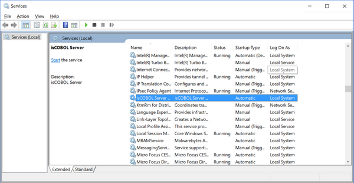

### isserver.exe usage

The service maintenance is done through isserver.exe.

To install the service, use the command:

```cobol
isserver -install
```

If the operation is successful, there will be a new entry in the Windows service manager.



The service is installed in auto mode, which means the service will automatically start along with the system.

To install the service in demand mode, use the command:

```cobol
isserver -install-demand
```

In this mode, the service must be manually started by the user in the Windows service manager.

To retrieve the service status, use the command:

```cobol
isserver -status
```

The exit code of this command is 0 when the service is running, 3 when it is not running and 1 when the state cannot be determined.

To start the service, use the command:

```cobol
isserver -start
```

To stop the service, use the command:

```cobol
isserver -stop
```

To uninstall the service, use the command:

```cobol
isserver -uninstall
```

If the command is successful, the isCOBOL Server service will disappear from the Windows service manager.

In some situations, you might want to install a Windows service as a non-interactive service so that the service does not have any possibility to access the GUI subsystem. In order to do that, add the phrase non-interactive after the -install parameter. A custom service name can still be specified after the non-interactive parameter:

```cobol
isserver -install non-interactive
```

It’s also possible to specify a custom name for the service. This name should be added as last parameter of isserver.exe command line for all the options. For example, the following list of commands manage an isCOBOL Server service named “myservice”:

```cobol
isserver -install myservice
isserver -start myservice
isserver -status myservice
isserver -stop myservice
isserver -uninstall myservice
```
