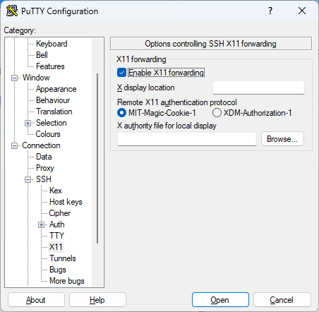
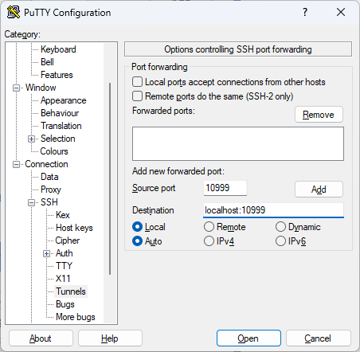
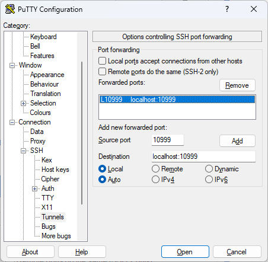
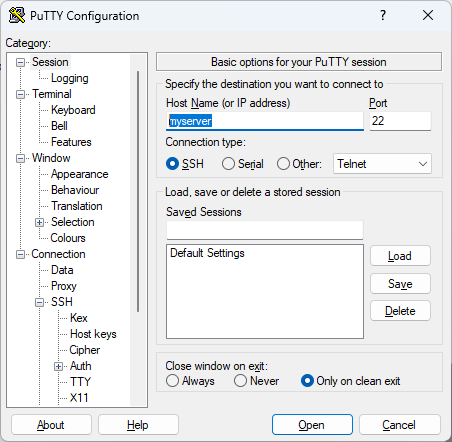

## Configuring Putty to use isCOBOL ClientListener

Enable X11forwarding and choose MIT-Magic-Cookie-1 as the authentication protocol.

In the Tunnels configuration specify the hostname and port of the ClientListener (in the screenshot below, default values have been used).

**Note:** In order for the above settings to work correctly, any other X11 services must be turned off. Otherwise you may experience unexpected behaviors.

Click on “Add”.

As a final step, configure the SSH connection, specifying the server name (or IP address) and choosing SSH as the connection protocol.

Connect to the server using the configured terminal emulator.

Ensure that the $ISCOBOL_DISPLAY environment variable is set to “X”. If it is not set, you can set it now.

At this point you can run any kind of application using the [Runtime Framework](../../is-cobol-evolve/SDK-Users-Guide/Compiler-and-Runtime/Runtime-Framework/Overview).

The iscrun command will launch a thin client instance and the program will be executed in a new window using the isCOBOL Server architecture.

When the COBOL program issues a SYSTEM call, the command will be executed in the terminal.
