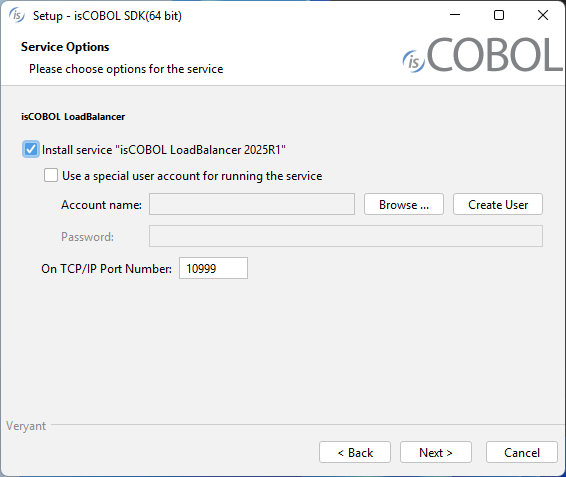

## Windows Service and Unix daemon

### Windows Service

On Windows it's possible to install isCOBOL LoadBalancer as a Windows Service.

The isCOBOL LoadBalancer service can be installed during the setup process:

When isCOBOL has been installed, the service can be installed, removed and managed through isbalancer.exe command line utility.
