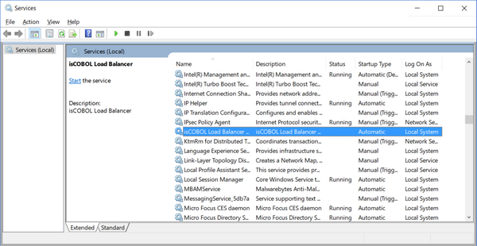

#### isbalancer.exe Usage

The service maintenance is done through isbalancer.exe.

To install the service, use the command:

```cobol
isbalancer -install
```

If the operation is successful, there will be a new entry in the Windows service manager.



The service is installed in auto mode, which means the service will automatically start along with the system.

To install the service in demand mode, use the command:

```cobol
isbalancer -install-demand
```

In this mode, the service should be manually started by the user in the Windows service manager.

To retrieve the service status, use the command:

```cobol
isbalancer -status
```

The exit code of this command is 0 when the service is running, 3 when it is not running and 1 when the state cannot be determined.

To start the service, use the command:

```cobol
isbalancer -start
```

To stop the service, use the command:

```cobol
isbalancer -stop
```

To uninstall the service, use the command:

```cobol
isbalancer -uninstall
```

If the command is successful, the isCOBOL LoadBalancer service will disappear from the Windows service manager.

In some situations, you might want to install a Windows service as a non-interactive service to prevent the service from accessing the GUI subsystem. In order to do that, add non-interactive after the -install parameter. A custom service name can still be specified after the non-interactive parameter:

```cobol
isbalancer -install non-interactive
```

It’s also possible to specify a custom name for the service. This name should be added as the last parameter of the isbalancer.exe command line for all the options. For example, the following list of commands manage an isCOBOL LoadBalancer service named “myservice”:

```cobol
isbalancer -install myservice
isbalancer -start myservice
isbalancer -status myservice
isbalancer -stop myservice
isbalancer -uninstall myservice
```
