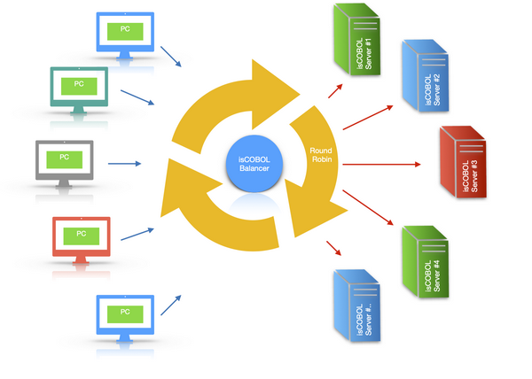

# isCOBOL LoadBalancer

isCOBOL Evolve includes a load balancing feature to distribute multiple client connections on different servers.

Once isCOBOL LoadBalancer is started, it waits for connections from clients, that can be either isCOBOL Clients or isCOBOL runtimes performing remote calls. When a connection request is performed, isCOBOL LoadBalancer evaluates the best server for satisfying the request, then it supplies the address of that server to the client. From this moment, the client communicates with the isCOBOL Server directly and the connection between the client and isCOBOL LoadBalancer is closed, therefore shutting down isCOBOL LoadBalancer doesn't close the current connections.

The destination isCOBOL Servers are not started by the load balancer, they must be started separately. The startup order is not relevant. This means you can start isCOBOL LoadBalancer before or after the isCOBOL Servers.
