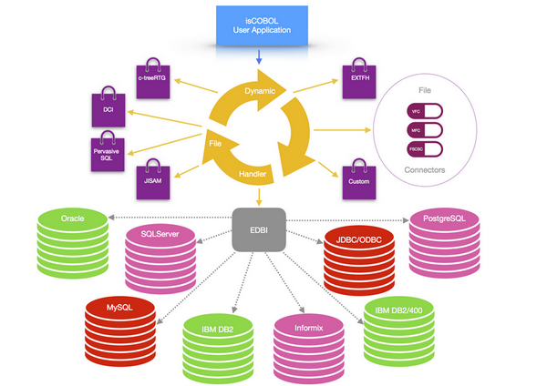

# Overview

This manual is intended for software developers who want to combine the reliability of COBOL programs with the flexibility and efficiency of a relational database management system (RDBMS). This manual gives systematic instructions on how to use DatabaseBridge, a program designed to allow for efficient management and integration of data with COBOL using the supported database engine.

DatabaseBridge (also known as EasyDB ) generates EDBI COBOL program interfaces that provide a communication channel between COBOL programs and supported RDBMS.

The EDBI routine allows COBOL programs to efficiently access information stored in the RDBMS.

In order to store data, COBOL programs usually use standard indexed files. Information stored in indexed files is traditionally accessed through standard COBOL I/O statements like READ, WRITE and REWRITE.

Traditionally, COBOL programmers use a technique called embedded SQL to embed SQL statements into the COBOL source code.

Though this technique is a good solution for storing information on a database using COBOL programs, it has some drawbacks. First, it implies COBOL programmers have a good knowledge of the SQL language.

Second, a program written in this way is not portable. In other words, it cannot work both with indexed files and the RDBMS. Furthermore, SQL syntax often varies from database to database. This means that a COBOL program embedding SQL statements tailored for a specific RDBMS might not work with another database. Finally embedded SQL is difficult to implement with existing programs. In fact, embedded SQL requires significant application re-engineering, including substantial additions to the working storage, data storage, and reworking the logic of each I/O statement.

DatabaseBridge, through the EDBI COBOL routine, allows the user to maintain existing COBOL code while accessing to the power of RDBMS. In this way, COBOL programmers need not be familiar with SQL and COBOL programs can stay portable with its indexed file system.

The isCOBOL dynamic file handler is used as a plug-in to the isCOBOL runtime, permitting management of data files from different file systems. With this feature, you can dynamically use different supported indexed file systems like c-tree and jisam or you can decide to use database management systems such as Oracle, DB2, DB2/400, DBMaker, Microsoft SQL Server, PostgreSQL, Informix and MySQL. Any ODBC/JDBC compliant RDBMS could be used with few limitations.

EDBI routines take care of different SQL syntax of supported RDBMS. EDBI routines are standard COBOL programs created at compile time from DatabaseBridge.

EDBI routines map COBOL fields into database fields adapting different COBOL data types into RDBMS data types and vice versa.