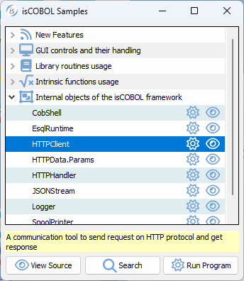

## HTTPClient class (com.iscobol.rts.HTTPClient)

The HTTPClient is an internal class that provides many useful features to communicate with existing HTTP services like Web Service (REST/SOAP) HTTP server etc.

A sample program can be found in isCOBOL Samples.

