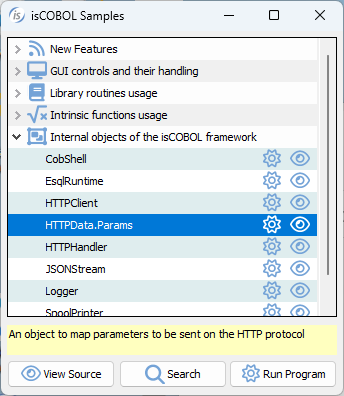

## HTTPData.Params class (com.iscobol.rts.HTTPData.Params)

The HTTPData.Params is an internal class that provides a simple way to define HTTP parameters to be passed in doGet and doPost methods.

A sample program can be found in isCOBOL Samples.

