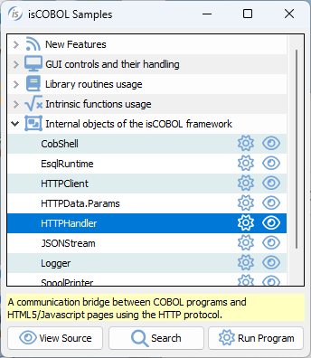

## HTTPHandler class (com.iscobol.rts.HTTPHandler)

The HTTPHandler is an internal class that provides a communication bridge between COBOL programs and HTML5/Javascript pages using the HTTP protocol.

A sample program can be found in isCOBOL Samples.

