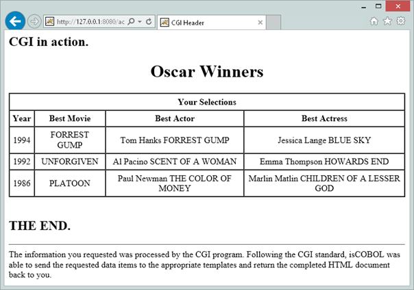
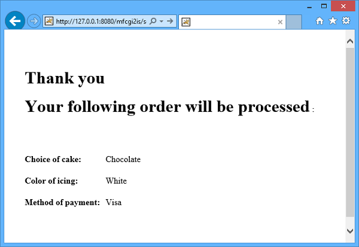

## COBOL Servlet Programming to replace CGI COBOL programming

This page will show you how to migrate older CGI COBOL programs to isCOBOL Servlets in order to take advantage of useful features of the HTTPHandler class. Usually only a few changes are required; most of your source code will remain unchanged.

### Conversion of the ACUCOBOL-GT Oscars sample

The following example is located in sample/eis/http/getpost/acucgi2is folder. The README.txt file explains how it works and how to deploy it.

This example needs to take the following steps:

 A POST form action invoking the COBOL program acting as a servlet to replace the CGI program:

```cobol
<FORM method="post" action="servlet/isCobol(OSCARS)">
```

This HTML document, called 'oscars.htm' will also include these controls:

```cobol
<input type=checkbox name=y1996 value=1996> 1996
<input type=checkbox name=y1995 value=1995> 1995
<input type=checkbox name=y1994 value=1994> 1994
<input type=checkbox name=y1993 value=1993> 1993
<P>
<input type=checkbox name=y1992 value=1992> 1992
<input type=checkbox name=y1991 value=1991> 1991
<input type=checkbox name=y1990 value=1990> 1990
<input type=checkbox name=y1989 value=1989> 1989
<P>
<input type=checkbox name=y1988 value=1988> 1988
<input type=checkbox name=y1987 value=1987> 1987
<input type=checkbox name=y1986 value=1986> 1986
<input type=checkbox name=y1985 value=1985> 1985
<P>
<input type=”submit” value=”Submit Query” >
```

When checking one or more years and pressing the 'Submit query' button, the OSCARS COBOL servlet program is called.

The OSCARS COBOL program needs to be compiled with the following options:

```cobol
-ca -smat
```

The following setting is required in the Runtime configuration:

```cobol
iscobol.http.stateless=true
```

The result choosing 1994, 1992 and 1986 is the following:



### Conversion of the Micro Focus sample

Using the above approach is also possible to migrate a Micro Focus COBOL CGI program to COBOL Servlet.

Under sample/eis/http/getpost/ mfcgi2is folder you find an example of a Micro Focus Cobol CGI program rewritten to run with the HTTP option of isCOBOL EIS.

The README.txt file explains how it works and how to deploy it.

This example needs to take the following steps:

- A POST form action invoking the COBOL program acting as a servlet to replace the CGI program:

```cobol
<BODY><FORM id=form1 name=form1 action="servlet/isCobol(WEBDEMO)" method=post >
```

This HTML document, called 'WebDemo.htm', will also include these controls:

```cobol
<INPUT id=checkbox1 type=checkbox value=on name=checkbox1>Vanilla
<INPUT id=checkbox2 type=checkbox value=on name=checkbox2>Chocolate
<INPUT id=checkbox3 type=checkbox value=on name=checkbox3>Marble
 
<INPUT id=radiobutton1 type=radio value=White name=radio>White
<INPUT id=radiobutton2 type=radio value=Chocolate name=radio>Chocolate
<INPUT id=radiobutton3 type=radio value=Blue name=radio>Blue
 
<SELECT id=select1 name=select1> <OPTION selected>Cash<OPTION>Visa<OPTION>Check<OPTION>Mac</OPTION></SELECT>
```

The WEBDEMO COBOL program needs to be compiled with the following options:

```cobol
-sa -exec=html
```

having the following regexp in the Compiler configuration:

```cobol
iscobol.compiler.regexp="call-convention" "|call-convention" \
                        "(?i)(\\(length )" "(length of " \
                        "(?i)( length )" "length of " \
                        "(?i)(CALL)\\s+(LLNK)" "CALL" 
```

The result choosing Chocolate cake, White icing and Visa payment is the following:


