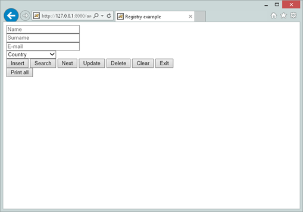

## COBOL Servlet Programming with AJAX and JSON

JSON or JavaScript Object Notation, is an open standard format that uses text easy to understand to transmit data objects consisting of attribute-value pairs. It is used primarily to transmit data between a server and web application, as an alternative to XML.

Although originally derived from the JavaScript scripting language, JSON is an independent data format, and code for parsing and generating JSON data is readily available in a large variety of programming languages.

Here we will show how to develop a simple web application of data file management that uses JSON stream to communicate data from COBOL servlet to HTML pages.

The following example is located in sample/eis/http/json folder. The README.txt file explains how it works and how to deploy it.

This example needs to take the following steps:

- Create an HTML file that is able to establish an AJAX communication using JSON stream to a COBOL servlet program:

In *awebx.htm* there is included a Javascript code based on JQUERY to be able to call some COBOL servlet entry point making a GET request type (default) and receiving JSON data stream:

```cobol
function callServer (cobolProg) {
    var url = "servlet/isCobol(" + cobolProg + ")";
    var parm = $("form").serialize();
      $.ajax(url, {
                    success: handleSuccess,
                    error: handleError,
                    data: parm
                 });
      return false;
   }
```

- Load all COBOL Servlet entry points using the following statement:

```cobol
callServer("AWEBX"); // program initialization
```

Note the once AWEBX COBOL Servlet is loaded the INIT paragraph is executed:

```cobol
       INIT.
           set declaratives-off to true.
           move low-values to r-awebx-email.
           open i-o awebxfile.
           set declaratives-on to true.
           if file-status > "0z" and file-status not = "41"
              open output awebxfile
              close awebxfile
              open i-o awebxfile.
           comm-area:>displayJSON (ok-page).
           goback.
```

Code is included that associates each AWEBX entry point to an HTML button, to be executed when the button is clicked:

```cobol
<input type="submit" value="Insert" onclick="return callServer('AWEBX_INSERT');">
<input type="submit" value="Search" onclick="return callServer('AWEBX_SEARCH');">
<input type="submit" value="Next"   onclick="return callServer('AWEBX_NEXT');">
<input type="submit" value="Update" onclick="return callServer('AWEBX_UPDATE');">
<input type="submit" value="Delete" onclick="return callServer('AWEBX_DELETE');">
```

Note that the above HTML is able to call the following COBOL servlet entry-point:

```cobol
        INSERT-VALUES.
            entry "AWEBX_INSERT" using comm-area.
            ...
            goback.
 
        SEARCH-VALUES.
            entry "AWEBX_SEARCH" using comm-area.
            ...
            goback.
 
        NEXT-VALUES.
            entry "AWEBX_NEXT" using comm-area.
            ...
            goback.
 
        UPDATE-VALUES.
            entry "AWEBX_UPDATE" using comm-area.
            ...
            goback.
```

- Define some fields in HTML to input data suitable for data management, such as name, surname, email, country etc:

```cobol
      <input type="text" name="name" size="25" placeholder="Name"/><br/>
      <input type="text" name="surname" size="25" placeholder="Surname"/><br/>
      <input type="text" name="email" size="25" placeholder="E-mail"/><br/>
      <select name="country"  placeholder="Country">
       <option value="" selected="selected" disabled="disabled">Country</option>
        <option value="us">US</option>
        <option value="it">Italy</option>
        <option value="fi">Finland</option>
        <option value="nl">The Netherlands</option>
        <option value="de">Germany</option>
        <option value="fr">France</option>
        <option value="sp">Spain</option>
        <option value="uk">United Kingdom</option>
      </select><br/>
```

- In COBOL Servlet create a working storage structure that matches the field name of previous HTML. It can be done with identified by clause:

```cobol
       01 comm-buffer identified by "_comm_buffer".
          03  filler identified by "_status".
              05 response-status pic x(2).
          03  filler identified by "_message".
              05 response-message pic x any length.
          03  filler identified by "name".
              05  json-name pic x any length.
          03  filler identified by "surname".
              05  json-surname pic x any length.
          03  filler identified by "email".
              05  json-email pic x any length.
          03  filler identified by "country".
              05  json-country pic x any length.
```

- In COBOL Servlet manage GET request by accept() answering with a JSON stream by displayJSON(). For example if "insert" is submitted the following entry point is invoked:

```cobol
       INSERT-VALUES.
           entry "AWEBX_INSERT" using comm-area.
           comm-area:>accept(comm-buffer).
           move spaces to error-status.
           perform check-values.
           if error-status = spaces
              move json-name    to r-awebx-name
              move json-surname to r-awebx-surname
              move json-email   to r-awebx-email
              move json-country to r-awebx-country
              write rec-awebxfile
              move "Operation successful" to ok-message;;
              comm-area:>displayJSON (ok-page)
           else
              comm-area:>displayJSON (error-page).
           goback.
```

- In a similar way when a "next" command is submitted, the records are returned back as JSON stream with the displayJSON() command:

```cobol
       NEXT-VALUES.
           entry "AWEBX_NEXT" using comm-area.
           read awebxfile next
           move r-awebx-name    to json-name
           move r-awebx-surname to json-surname
           move r-awebx-email   to json-email
           move r-awebx-country to json-country
           move "OK" to response-status
           move "" to response-message;;
           comm-area:>displayJSON (comm-buffer).
           goback.
```

This is the output form of awebx.htm used in this example:


