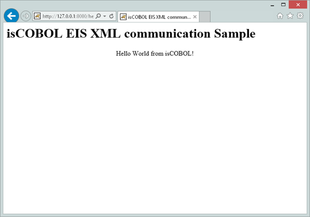

## COBOL Servlet Programming with AJAX and XML

AJAX ( Asynchronous JavaScript and XML) is a group of interrelated Web development techniques used on the client side to create asynchronous Web Applications. With Ajax, Web applications can send data to, and retrieve data from, a server asynchronously (in the background) without interfering with the display and behavior of the existing page.

Extensible Markup Language (XML) is a text format derived from Standard Generalized Markup Language (SGML). Compared to SGML, XML is simple. HyperText Markup Language (HTML), by comparison, is even simpler. Even so, a good reference book on HTML is an inch thick. This is because the formatting and structuring of documents is a complicated business.

Most of the excitement about XML is related to a new role as an interchangeable data serialization format. XML provides two enormous advantages as a data representation language:

- It is text-based
- It is position-independent

The scope of this paragraph is to show how to develop a simple web application that uses XML stream to communicate data from COBOL servlet to a Web form.

The following example called HELLO.cbl, is located in sample/eis/http/xml folder. The README.txt file explains how it works and how to deploy it.

This example needs to take the following steps:

- Create an HTML file called index.html that is able to establish an AJAX communication to receive an XML stream from COBOL servlet program:

In *index.html* there is included a Javascript code based on JQUERY to be able to call some COBOL servlet entry points making a GET request type (default) and receiving XML data stream:

```cobol
   function callServer (cobolProg) {
      var url = "servlet/isCobol(" + cobolProg + ")";
      jQuery.ajax(url, {
                    success: handleSuccess,
                    error: handleError 
                 });
      return false;
   }
```

- Load all COBOL Servlets using the following statement:

```cobol
window.onload = callServer('HELLO');
```

Note that when HELLO COBOL Servlet is loaded the following code executed:

```cobol
      move "Hello World from isCOBOL!" to xml-hellotext.
      lnk-area:>displayXML (hello-buffer).
```

And XML stream is returned to the Web form with the displayXML() command.

When running this example the result is the following:


