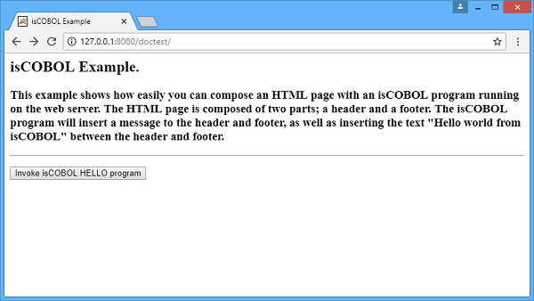
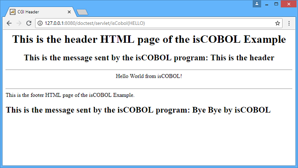

## COBOL Servlet Programming

Following you will find an explanation about how to develop a simple COBOL servlet that builds an HTML page using a header.htm page and a footer.htm page, filling them with the correct message and sending a text string between them, the string is "Hello world from isCOBOL!".

The Web Servlet container used for this example is Tomcat 10.

This program needs to take the following steps:

- Create a folder called doctest with the following structure:

```cobol
doctest/
        WEB-INF/
                classes
                lib
```

- Create a file called web.xml in doctest/WEB-INF folder with the following content:

```cobol
c<?xml version="1.0" encoding="UTF-8"?>
<web-app xmlns:xsi="http://www.w3.org/2001/XMLSchema-instance" xmlns="http://java.sun.com/xml/ns/javaee" xmlns:web="http://java.sun.com/xml/ns/javaee/web-app_2_5.xsd" xsi:schemaLocation="http://java.sun.com/xml/ns/javaee http://java.sun.com/xml/ns/javaee/web-app_2_5.xsd" id="WebApp_ID" version="2.5">
  <display-name>isCOBOL EIS</display-name>
  <welcome-file-list>
    <welcome-file>Hello.htm</welcome-file>
  </welcome-file-list>
  <filter>
        <filter-name>isCOBOL filter</filter-name>
        <filter-class>com.iscobol.webjakarta.IscobolFilter</filter-class>
  </filter> 
  <filter-mapping>
        <filter-name>isCOBOL filter</filter-name>
        <url-pattern>/servlet/*</url-pattern>
  </filter-mapping>
  <servlet> 
        <servlet-name>isCobol</servlet-name>
        <servlet-class>com.iscobol.webjakarta.IscobolServletCall</servlet-class>
  </servlet>
  <servlet-mapping>
        <servlet-name>isCobol</servlet-name>
        <url-pattern>/servlet/*</url-pattern>
  </servlet-mapping>
  <listener>
   <listener-class>com.iscobol.webjakarta.IscobolSessionListener</listener-class>
  </listener>
</web-app>
```

**Note** - The above classes are suitable for Jakarta servlet containers like Tomcat 10. To run on JEE servlet containers (like Tomcat 9 or previous) replace the "com.iscobol.webjakarta" package with the "com.iscobol.web" package.

- The *IscobolServletCall* class is responsible for calling the COBOL program whose name was passed in the URL.
- The *IscobolFilter* class is responsible to keep each session isolated from the others, to avoid conflicts on the access to global items such as external data items or configuration variables.
- The *IscobolSessionListener* class is responsible for initializing the runtime environment when a new session starts and release it gracefully when the session terminates or gets invalidated.

- Create a *Hello.htm* web form to call a COBOL servlet called HELLO:

```cobol
<HTML><HEAD><TITLE>isCOBOL Example</TITLE></HEAD>
<BODY>
<H2>isCOBOL Example.</H2>
<H3>This example shows how easily you can compose an HTML page with an isCOBOL program running on the web server. The HTML page is composed of two parts; a header and a footer. The isCOBOL program will insert a message to the header and footer, as well as inserting the text "Hello world from isCOBOL" between the header and footer.</H3>
<HR size="2">
<FORM method="post" action="servlet/isCobol(HELLO)">
    <p><input type="submit" value="Invoke isCOBOL HELLO program" /></p>
</FORM>
```

Note that in POST method of HTML form there is the call of the COBOL Servlet called HELLO.

- Create a *Header.htm* as follow:

```cobol
<HTML>
<HEAD><TITLE>CGI Header</TITLE></HEAD>
<BODY>
<CENTER>
<H1>This is the header HTML page of the isCOBOL Example</H1>
<H2>This is the message sent by the isCOBOL program: %%opening-message%%</H2>
<HR>
```

Note that this form displays the top of the HTML page that the program HELLO.cbl will build; as we can see, the <HTML\>, <BODY\> and <CENTER\> tags are not closed, and there is the string %%opening-message%% that will be managed and replaced by the COBOL servlet program.

- Create a *Footer.htm* web form as follow:

```cobol
</CENTER>
<BR>
<HR>
This is the footer HTML page of the isCOBOL Example.
<H2>This is the message sent by the isCOBOL program: %%closing-message%%</H2>
</BODY></HTML>
```

Note that this form displays the bottom of the HTML page that the program HELLO.cbl will build. Here the tags <HTML\>, <BODY\> and <CENTER\> are closed and there is the string %%closing-message%% that will be managed and replaced by the COBOL servlet program.

- Create a *HELLO.cbl* COBOL Servlet program as follows:

```cobol
       PROGRAM-ID. HELLO initial.
       CONFIGURATION SECTION.
       REPOSITORY.
       class web-area as "com.iscobol.rts.HTTPHandler"
           .
       WORKING-STORAGE SECTION.
       01  hello-buffer pic x(40) value "Hello World from isCOBOL!".
       01  rc pic 9.
       01  html-header-form identified by "Header".
            05  identified by "opening-message".
                10 opening-message pic x(40).
       01  html-footer-form identified by "Footer".
            05  identified by "closing-message".
                10  closing-message pic x(40).
 
       LINKAGE SECTION.
       01 comm-area object reference web-area.
       PROCEDURE DIVISION using comm-area.
       MAIN-LOGIC.
           move "This is the header" to opening-message
           set rc = comm-area:>processHtmlFile (html-header-form).
           comm-area:>displayText  (hello-buffer).
           move "Bye Bye by isCOBOL" to closing-message
           set rc = comm-area:>processHtmlFile (html-footer-form).
           goback.
```

Note that the COBOL servlet does the following steps:

- Move the value "This is the header" to the variable opening-message of the structure prepared for Header.htm
- Add to the HTML page source (that currently is empty) the Header.htm form replacing the string %%opening-message%% by the opening-message variable value
- Add to the HTML page the text "Hello world from isCOBOL!"
- Move the value "Bye Bye by isCOBOL" to the variable closing-message of the structure prepared for Footer.htm
- Add to the HTML page source the Footer.htm form replacing the string %%closing-message%% by the closing-message variable value

at the exit of the program, the page HTML will be sent to the Web Server.

- Compile HELLO.cbl without any specific options and copy HELLO.class under doctest/WEB-IF/classes folder
- Create a iscobol.properties file under doctest/WEB-IF/classes folder with a property to inform isCOBOL EIS framework of the path of all HTML useful files:

```cobol
iscobol.http.html_template_prefix=webapps/doctest
```

- Copy the isCOBOL runtime library (iscobol.jar) to the doctest/WEB-IF/lib folder.
- Create a war file to be deployed in Tomcat called doctest.war that includes all files of doctest folder. It can be done with the following command:

```cobol
jar -cfv doctest.war *
```

Once doctest.war file is deployed correctly in Tomcat servlet container, we can try it using http://127.0.0.1:8080/doctest, assuming Tomcat is running on the localhost and using the default port, 8080.



By pressing the "Invoke isCOBOL Hello program" button, the result is:


