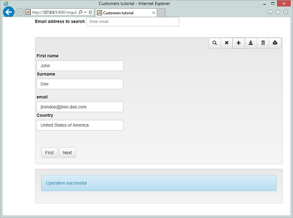

# HTML5/CSS3 JS and JSON

## isCOBOL and AngularJS

With isCOBOL EIS taking advantage of COBOL REST producer and JSON COBOL integration, it is possible to write a Rich GUI Client Desktop application based on HTML5 and CSS3.

The client javascript library we recommend to work with is called AngularJS ([http://angularjs.org/](http://angularjs.org/)), and is developed and supported by Google.

This library, among other things, makes it easy to bind the data model coming from isCOBOL programs to the web page. An angular application is built on views and controllers. Each view (a page or part of a page) is handled by a controller, which fetches data from the isCOBOL servlet and binds it to the view's components.

The example page is described below and you’ll find all sources on sample/eis/other/angularjs.



First of all we need to include all relevant javascript and CSS files in the head of HTML page:

```cobol
<link href="css/bootstrap.min.css" rel="stylesheet" media="screen"/>
<link href="css/bootstrap-theme.min.css" rel="stylesheet" media="screen"/>
<link href="css/customers.css" rel="stylesheet" media="screen"/>
<script type="text/javascript" src="js/jquery.js"></script>
<script type="text/javascript" src="js/angular.min.js"></script>
<script type="text/javascript" src="js/bootstrap.min.js"></script>
<script type="text/javascript" src="js/app.js"></script>
```

Then we should indicate the tag ng-app in the  declaration in order to load the library and process all directives in the page:

```cobol
<html ng-app="appTutorial">
```

All code to manage the HTML application is contained in the file *app.js*.

Let's examine it:

- It contains the application declaration (*angular.module('appTutorial', \[\]);*)
- It defines a controller CustomersCtrl which will handle a customer page

The controller includes a $*scope* variable, which represents the current instance of the controller itself, and $*http*, which is an object provided by the AngularJS library that supports http requests to servers.

We define our model using $*scope.customer={}*, which creates an empty JSON object that will be filled by the isCobol program:

```cobol
$scope.customer={};
```

Also, the controller defines methods to handle the buttons placed in the form, used for data navigation and processing. For example, the *getNextCustomer* method calls a COBOL entry point called AWEBX-NEXT that fetches the next customer in the dataset:

```cobol
 $scope.getNextCustomer = function() {
        $http.get("servlet/isCobol(AWEBX_NEXT)")
           .then(function (response) {
                if (response.data._comm_buffer._status=="OK")
                    $scope.customer = response.data._comm_buffer;
           })
 }
```

Next, we need to bind the page, or a section of a page, to a controller. In this sample we bind the *CustomerCtrl* (Customer Controller) to a div, this means that each control inside the div will have access to the model and methods defined in the controller. The binding is done using the directive

```cobol
<div class="container" ng-controller="CustomersCtrl">
```

inside the <div...\> tag right after the body.

Inside the div we define an HTML form, which will be handled by the CustomerCtrl as well. This is done by specifying the directive ng-action="performSearch()" inside the form. Form submission will trigger the PerformSearch method of the controller:

```cobol
<form ng-submit="performSearch()" class="form-inline" role="form">
```

Notice how each button in the form is bound to a method in the controller, meaning that the click will be handled by the method specified in the ng-click directive. Each INPUT tag in the form is bound to one of the data model defined in the controller. In this tutorial we only have one model: customer.

The structure of this model is defined in the AWEBX.cbl COBOL source code. Each time AWEBX.cbl is executed it returns the "response" record, which contains status about the performed operation and a customer record:

```cobol
         01 comm-buffer identified by "_comm_buffer".
            03  filler identified by "_status".
               05 response-status pic x(2).
            03  filler identified by "_message".
               05 response-message pic x any length.
            03  filler identified by "name".
               05  json-name pic x any length.
            03  filler identified by "surname".
               05  json-surname pic x any isc.
            03  filler identified by "email".
               05  json-email pic x any length.
            03  filler identified by "country".
               05  json-country pic x any length.
```

Let's examine how the processing of a web request is done in an Angular controller:

Take a look at the getNextCustomer method:

```cobol
$scope.getNextCustomer = function() {
     $http.get("servlet/isCobol(AWEBX_NEXT)")
           .then(function (response) {
                if (response.data._comm_buffer._status=="OK")
                    $scope.customer = response.data._comm_buffer;
          })
}
```

It calls the isCOBOL program, using the entry point AWEBX\_NEXT. This call is asynchronous, meaning that the javascript code will continue executing while the http object is fetching the data.

When the server returns with data (or an error), the .then() method will be called.

The .then method expects as a parameter a function which receives a response object as its own parameter. The response.data field contains the response model defined in the AWEBX.cbl file.

The function needs to check if the fetch operation was successful:

```cobol
if (response.data._comm_buffer._status=="OK")
```

and, if so, it will extract the customer model and make it available in the controller:

```cobol
$scope.customer = response.data._comm_buffer;
```

This will automatically display the model data in the input tags of the form. Each input has an ng-model directive, which holds the field that will be bound to the edit field:

```cobol
<input type="text" class="form-control" ng-model="customer.name" id="edFirstname" style="width:280px" />
```

As the user modifies the content of the input field, the model in the controller is automatically updated.

So, all we need to do in order to save the changes is to post the model to the isCOBOL program.

This is done in the saveCustomer (or newCustomer) method of the controller. All we need to do is call the isCOBOL program, using the right entry point, AWEBX\_UPDATE (AWEBX_INSERT), and pass it the customer model:

```cobol
$scope.saveCustomer = function() {
            callServerWithJson("AWEBX_UPDATE",  
$scope.customer, $scope.onSuccess, $scope.onError);
}
```

The *callServerWithJson* utility method accepts the entry point to call, a model to pass to the isCOBOL program, and 2 callbacks, that specify the function to execute if the http request is successful *onSuccess*, or if it fails onError.

Notice that the *onSuccess* will be called even if the isCOBOL program generates an error (duplicated key, record locked, and so on). This is because the HTTP request was carried out successfully, but a logical program error occurred. So the *onSuccess* method needs to check the response object and handle it appropriately.

The *onError* callback will be invoked only if the http request fails (network error, server error,...).
