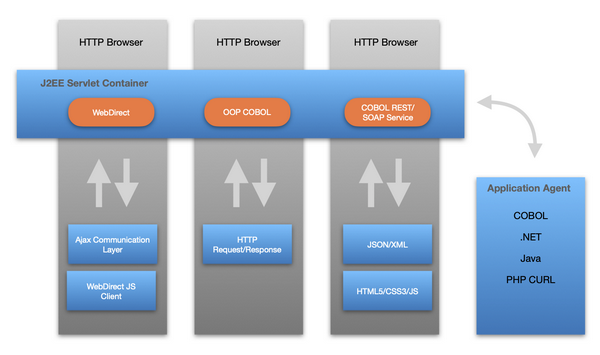

# Introduction

## Overview

isCOBOL Extend Internet System (EIS) is an umbrella of tools and features available in the isCOBOL Evolve Suite that allows development and execution of a web based application in a JEE container. There are several options to deploy a web application based on EIS as shown in the figure below, isCOBOL Extend Internet System Architecture, in order to provide the right option for every scenario.

### isCOBOL Extend Internet System Architecture

