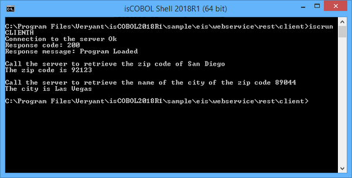

### COBOL REST consumer

In order to develop a COBOL REST consumer (client-side), to invoke REST Web Service, the COBOL program should take advantage of *HTTPClient* class that allows it to communicate with COBOL REST producer entry points through HTTP protocol. Also to allow the definition of HTTP parameters, an *HTTPData.Params* class is provided.

In the isCOBOL sample folder you will find the folder eis/webservices/rest/client that contains an example of COBOL client program called "CLIENTH.cbl" to communicate with the "ISFUNCTIONS.cbl" server service described on the previous page.

This program invokes ISFUNCTION\_GETZIP service to return the zip code of San Diego, and the ISFUNCTION_GETCITY service to return the name of the city whose zip code is 89044.

This program shows how to do the following necessary steps:

- Include HTTPClient and HTTPData.Params classes in COBOL repository:

```cobol
       configuration section.
       repository.
           class http-client as "com.iscobol.rts.HTTPClient"
           class http-param  as "com.iscobol.rts.HTTPData.Params".
```

- Establish the connection with REST Web Service using doGet() method and checking the success of the operation using getResponseCode() method:

```cobol
           http:>doGet("http://127.0.0.1:8080/isfunctions/servlet/isCobol(ISFUNCTIONS)")
           http:>getResponseCode (response-code)
```

- Prepare the city name as parameter to be pass to the service

```cobol
          move "San Diego" to city-zipCode.
          set params = http-param:>new():>add("get_Zip_Code", city-zipCode).
```

- Invoke the ISFUNCTION_GETZIP with prepared parameter and getting back the zip code:

```cobol
           http:>doGet ("http://127.0.0.1:8080/isfunctions/"
                        "servlet/isCobol(ISFUNCTION_GETZIP)", params)
 
           http:>getResponseCode (response-code)
           if response-code = 200
              http:>getResponseJSON (isfunction-retrievedZipCode)
```

where isfunction-retrievedZipCode working storage structure is defined like:

```cobol
       01  isfunction-retrievedZipCode identified by "".
            03 identified by "Zip_Code".
               05 zipCode  pic x any length.
```

and 92123 is the zip code of San Diego saved into zipCode COBOL variable.

A similar approach is followed to provide the city name and receive it's zip code.

- Compile the program with the command:

```cobol
iscc client.cbl
```

- and run it with the command:

```cobol
iscrun CLIENTH
```

this is the result:


