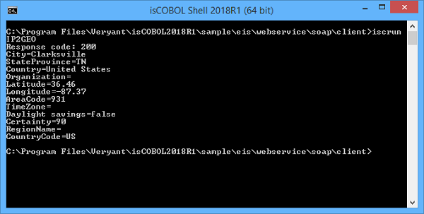

### COBOL SOAP consumer

In order to develop a COBOL SOAP consumer (client-side), to invoke a SOAP Web Service, the COBOL program should take advantage of *HTTPClient* class. This class contains several useful methods to work with SOAP Web Service.

In the isCOBOL sample folder you find the folder eis/webservices/soap/client that contains an example of COBOL client program called "IP2GEO.cbl" that shows how to use a SOAP Web Service available over the internet at [http://ws.cdyne.com/ip2geo/ip2geo.asmx](http://ws.cdyne.com/ip2geo/ip2geo.asmx).

This service "Resolves IP addresses to Organization, Country, City, and State/Province, Latitude, Longitude. In most US cities it will also provide some extra information such as Area Code, and more."

A SOAP Web Service usually provides a way to inquire about the functionality available and the parameters that should be used.

The isCOBOL [STREAM2WRK](../../../is-cobol-evolve/SDK-Users-Guide/Utilities/STREAM2WRK) command line utility simplifies the creation of the working storage definitions needed to manage the XML envelope. STREAM2WRK reads the WSDL definition from a URL, with the ?WSDL appended to it. For example, [http://ws.cdyne.com/ip2geo/ip2geo.asmx?WSDL](http://ws.cdyne.com/ip2geo/ip2geo.asmx?WSDL) was used to generate this working storage:

```cobol
      *> binding name=ResolveIP, style=document
       01  soap-in-ResolveIP identified by 'soapenv:Envelope'.
           03 identified by 'xmlns:soapenv' is attribute.
            05 filler pic x(39) value 'http://www.w3.org/2003/05/soap-envelope'.
           03 identified by 'xmlns:tns' is attribute.
            05 filler pic x(20) value 'http://ws.cdyne.com/'.
           03 identified by 'soapenv:Body'.
               06 identified by 'tns:ResolveIP'.
                07 identified by 'tns:ipAddress'.
                 08 a-ipAddress pic x any length.
                07 identified by 'tns:licenseKey'.
                 08 a-licenseKey pic x any length.
 
       01  soap-out-ResolveIP identified by 'Envelope'
                 namespace 'http://www.w3.org/2003/05/soap-envelope'.
           03 identified by 'Body'.
               06 identified by 'ResolveIPResponse'
                  namespace 'http://ws.cdyne.com/'.
                07 identified by 'ResolveIPResult'.
                 08 identified by 'City'.
                  09 a-City pic x any length.
                 08 identified by 'StateProvince'.
                  09 a-StateProvince pic x any length.
                 08 identified by 'Country'.
                  09 a-Country pic x any length.
                 08 identified by 'Organization'.
                  09 a-Organization pic x any length.
                 08 identified by 'Latitude'.
                  09 a-Latitude pic s9(16)v9(2).
                 08 identified by 'Longitude'.
                  09 a-Longitude pic s9(16)v9(2).
                 08 identified by 'AreaCode'.
                  09 a-AreaCode pic x any length.
                 08 identified by 'TimeZone'.
                  09 a-TimeZone pic x any length.
                 08 identified by 'HasDaylightSavings'.
                  09 a-HasDaylightSavings pic x any length.
                 08 identified by 'Certainty'.
                  09 a-Certainty pic s9(5).
                 08 identified by 'RegionName'.
                  09 a-RegionName pic x any length.
                 08 identified by 'CountryCode'.
                  09 a-CountryCode pic x any length.
```

The IP2GEO program will invoke the *ResolveIP* functionality providing the IP address and receiving some geographic information like City, State, Country, etc.

This program shows how to do the following necessary steps::

- Include HTTPClient class in COBOL repository:

```cobol
       configuration section.
       repository.
           class http-client as "com.iscobol.rts.HTTPClient"
```

- Include the working storage definition to use XML envelope generated from WSDL by STREAM2WRK utility:

```cobol
       WORKING-STORAGE SECTION.
       copy "ip2geo.cpy".
```

- Provide the IP address to obtain information and call the ResolveIP service using doPostEx() method passing the URL of service, the SOAP media type and the input envelope generated from STREAM2WRK for ResolveIP service:

```cobol
           move "209.235.175.10"   to a-ipAddress
           http:>doPostEx (
                           "http://ws.cdyne.com/ip2geo/ip2geo.asmx"
                           "text/xml; charset=utf-8"
                           soap-in-ResolveIP).
```

**Note** - The type "text/xml;charset=utf-8" is suitable for SOAP v1.1. If the service is SOAP v1.2, use "application/soap+xml; charset=utf-8" instead.

- Check the response if successful and show results:

```cobol
           http:>getResponseCode (response-code).
           display "Response code: " response-code.
           if response-code = 200
              http:>getResponseXML (soap-ResolveIP-output)
              display "City=" a-city
              display "StateProvince=" a-stateProvince
              display "Country=" a-country
              display "Organization=" a-Organization
              display "Latitude=" a-latitude
              display "Longitude=" a-longitude
              display "AreaCode=" a-areaCode
              display "TimeZone=" a-timeZone
              display "Daylight savings=" a-HasDaylightSavings
              display "Certainty=" a-certainty
              display "RegionName=" a-regionName
              display "CountryCode=" a-countryCode
```

Compile the program with the command:

```cobol
iscc IP2GEO.cbl
```

and run it with the command:

```cobol
iscrun IP2GEO
```

This is the result of execution of IP2GEO that consumes the ResolveIP SOAP Web Service:


