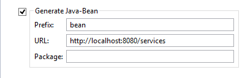

### Web Service Beans

The Service Bridge facility can also generate bean classes that can be used client side for test purposes.

#### Command-line usage

In order to enable this feature when compiling from the command-line, the configuration property [iscobol.compiler.servicebridge.bean](../../../is-cobol-evolve/SDK-Users-Guide/Compiler-and-Runtime/Configuration/Configuration-Properties#compiler_servicebridge_bean) must be set to the same value as [iscobol.compiler.servicebridge.type](../../../is-cobol-evolve/SDK-Users-Guide/Compiler-and-Runtime/Configuration/Configuration-Properties#compiler_servicebridge_type).

The following configuration entries demonstrate how to generate bean classes for a REST Web Service.:

```cobol
iscobol.compiler.servicebridge=1
iscobol.compiler.servicebridge.type=REST
iscobol.compiler.servicebridge.bean=REST
```

With this kind of configuration, at the end of the compilation process, you will find two folders: "bean" and "servicebridge".

The "bean" folder contains:

- *beanSONGS.cbl*: the bean that allows to test the REST Web Service
- *beanSONGS.cpy:* copybook used by beanSONGS.cbl
- *beanSONGS.wrk*: copybook used by beanSONGS.cbl

The "servicebridge" folder contains:

- *restSONGS.cbl*: the bridge program that allows our songs program to be called as REST Web Service.

Refer to the installed sample README file for instructions about the deployment and testing of these items.

The same result can be obtained by setting the necessary properties directly in the source code, using the [SET Directive](../../../is-cobol-evolve/SDK-Users-Guide/Compiler-and-Runtime/Compiler/Compiler-Directives/SET-Directive). For example:

```cobol
      $set "servicebridge" "1"
      $set "servicebridge.type" "REST"
      $set "servicebridge.bean" "REST"
       PROGRAM-ID. SONGS.
```

#### Usage in the IDE

In order to enable this feature within the isCOBOL Service Editor, just check the option *Generate Java-Bean*.



#### Bean structure

The bean class exposes the following methods:

| | |
| --- | --- |
| get<parameter_name\>() | Returns the value of the given parameter. *parameter_name* doesn’t necessarily match the COBOL data item. This name is affected by [ELK Directives](../../../is-cobol-evolve/Language-Reference/ELK-Directives/ELK-Directives). |
| set<parameter_name\>() | Sets the value of the given parameter. *parameter_name* doesn’t necessarily match the COBOL data item. This name is affected by [ELK Directives](../../../is-cobol-evolve/Language-Reference/ELK-Directives/ELK-Directives). |
| | |

The above pair of methods is repeated for each Linkage Section item. Other methods exposed:

| | |
| --- | --- |
| get_url() | Returns the URL to which the bean is going to connect |
| run (<parameters\>) | Executes the call to the Web Service passing the received parameters. The number of parameters required matches with the number of Linkage Section items expected by the COBOL program server side. |
| run() | Executes the call to the Web Service passing the parameters that were previously set by invoking set<*parameter_name*\>() |
| set_url() | Sets the URL to which the bean is going to connect |
| | |

The bean source code also includes two copybooks that allow you to include custom code.

| | |
| --- | --- |
| <beanPrefix\><programName\>.wrk | Copybook that hosts custom data items. |
| <beanPrefix\><programName\>.cpy | Copybook that hosts custom procedural code. |
| | |

By using these copybooks you can invoke *set<parameter_name\>()* to set the parameters for the Web Service and then invoke *run()*. In this way you obtain a stand alone COBOL program that can consume the Web Service.
