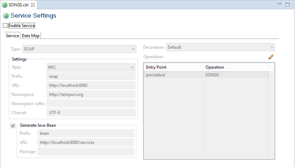
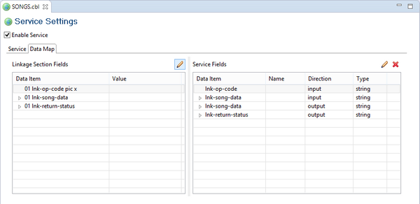
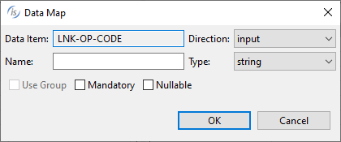
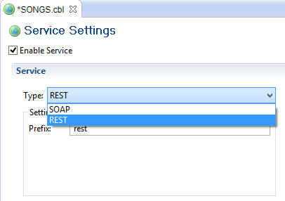

### Web Service generation with isCOBOL IDE

In order to be able to easily test our Web Service at the end of the process, create a isCOBOL Project.

1. Click *File* in the menu bar
2. Select *New*
3. Choose *isCOBOL Project*

Once the new project is created

1. Copy the SONGS.cbl source file to the *source* folder of the project
2. Right click on SONGS.cbl
3. Select *Open With*
4. Choose *isCOBOL Service Editor*

The following editor will open

1. Check the option *Enable Service*

If no action is taken, the Compiler generates a Web Service parameter for each elementary COBOL data item and the parameter is assumed to be input/output. In this case instead we wish to define the first group item as input, the second as i/o, and the third as output, because the archive record buffer is shared between caller and callee, while the other two parameters are one-way, so switch to the Data Map tab and

2. Delete *lnk-return-status* | *input* from the *Service Fields* list as we want this field only as output
3. Delete *lnk-op-code* | *output* from the *Service Fields* list as we want this field only as input

By double clicking on items in the *Service Fields* list, a pop-up dialog appears and allows you to set additional attributes:

As soon as you save modification in this editor, the SONGS.cbl source file is automatically updated as follows:

- the directive *$set “servicebridge” “1”* is added at the top of the source file
- the directive *$elk input* is added on top of the lnk-op-code group item
- the directive *$elk output* is added on top of the lnk-returns-status group item

At this point you can compile SONGS.cbl.

At the end of the compilation process, you will find two additional files in your project:

- *source/soapSONGS.cbl* : the bridge program that allows our program to be called as Web Service, and
- *output/SONGS.wsdl* : the XML descriptor of the service

You can start your Web Service with the following steps:

- Right click on the project name
- Select *Run As*
- Choose *isCOBOL EIS Servlet*

We’ve just demonstrated how to create a SOAP Web Service. With the next step, we’re going to generate a REST Web Service instead. To achieve it, return to the Service Editor and change the field *Type* from SOAP to REST.

**Note** - By switching the Type value, the Settings frame content changes, allowing to set only the settings that are suitable for the selected service type.

After it, save modification and recompile SONGS.cbl to obtain the following new item in the project *source* folder:

- *restSONGS.cbl* : the bridge program that allows our songs program to be called as REST Web Service.

You can start your Web Service with the following steps:

- Right click on the project name
- Select *Run As*
- Choose *isCOBOL EIS Servlet*

#### Service Editor fields

In this section we map all the fields of the Service Editor with the corresponding Compiler property or directive that will be generated when you save modification.

| Service Editor field | Corrsponding Compiler property/directive |
| --- | --- |
| Decoration | [DECORATION Directive](../../../is-cobol-evolve/Language-Reference/ELK-Directives/DECORATION-Directive) |
| Direction | [INPUT Directive](../../../is-cobol-evolve/Language-Reference/ELK-Directives/INPUT-Directive) [OUTPUT Directive](../../../is-cobol-evolve/Language-Reference/ELK-Directives/OUTPUT-Directive) |
| Enable Service | [iscobol.compiler.servicebridge (boolean)](../../../is-cobol-evolve/SDK-Users-Guide/Compiler-and-Runtime/Configuration/Configuration-Properties#compiler_servicebridge) |
| Generate Java-Bean / Prefix | [iscobol.compiler.servicebridge.bean.prefix](../../../is-cobol-evolve/SDK-Users-Guide/Compiler-and-Runtime/Configuration/Configuration-Properties#compiler_servicebridge_bean_prefix) |
| Generate Java-Bean / URL | [iscobol.compiler.servicebridge.bean.url](../../../is-cobol-evolve/SDK-Users-Guide/Compiler-and-Runtime/Configuration/Configuration-Properties#compiler_servicebridge_bean_url) |
| Mandatory | [MANDATORY Directive](../../../is-cobol-evolve/Language-Reference/ELK-Directives/MANDATORY-Directive) |
| Name | [NAME Directive](../../../is-cobol-evolve/Language-Reference/ELK-Directives/NAME-Directive) |
| Namespace | [iscobol.compiler.servicebridge.soap.namespace](../../../is-cobol-evolve/SDK-Users-Guide/Compiler-and-Runtime/Configuration/Configuration-Properties#compiler_servicebridge_soap_namespace) |
| Nullable | [NULLABLE Directive](../../../is-cobol-evolve/Language-Reference/ELK-Directives/NULLABLE-Directive) |
| Operations | [OPERATION Directive](../../../is-cobol-evolve/Language-Reference/ELK-Directives/OPERATION-Directive) |
| Package | [iscobol.compiler.servicebridge.bean.package](../../../is-cobol-evolve/SDK-Users-Guide/Compiler-and-Runtime/Configuration/Configuration-Properties#compiler_servicebridge_bean_package) |
| Settings / Prefix | [iscobol.compiler.servicebridge.rest.prefix](../../../is-cobol-evolve/SDK-Users-Guide/Compiler-and-Runtime/Configuration/Configuration-Properties#compiler_servicebridge_rest_prefix) [iscobol.compiler.servicebridge.soap.prefix](../../../is-cobol-evolve/SDK-Users-Guide/Compiler-and-Runtime/Configuration/Configuration-Properties#compiler_servicebridge_soap_prefix) |
| Settings / URL | [iscobol.compiler.servicebridge.soap.url](../../../is-cobol-evolve/SDK-Users-Guide/Compiler-and-Runtime/Configuration/Configuration-Properties#compiler_servicebridge_soap_url) |
| Style | [iscobol.compiler.servicebridge.soap.style](../../../is-cobol-evolve/SDK-Users-Guide/Compiler-and-Runtime/Configuration/Configuration-Properties#compiler_servicebridge_soap_style) |
| Type | [iscobol.compiler.servicebridge.type](../../../is-cobol-evolve/SDK-Users-Guide/Compiler-and-Runtime/Configuration/Configuration-Properties#compiler_servicebridge_type) |
| Use Group | [USE GROUP Directive](../../../is-cobol-evolve/Language-Reference/ELK-Directives/USE-GROUP-Directive) |
| Value | [VALUE Directive](../../../is-cobol-evolve/Language-Reference/ELK-Directives/VALUE-Directive) |
