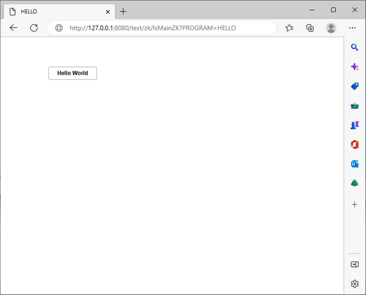

## Developing a hello world application from scratch

The next chapter illustrates the steps to create a hello world application from scratch, compile it, deploy it and eventually debug it.

### Writing the source

Programs for the web are standard COBOL programs. The following source code produces a screen with a button titled "Hello World":

```cobol
       PROGRAM-ID. HELLO.
       SCREEN SECTION.
       01  SCREEN1.
        03 PUSH-BUTTON 
           LINE  4 
           COL   4
           SIZE 15 CELLS
           TITLE "Hello World"
           EXCEPTION-VALUE 100
         .
       PROCEDURE DIVISION.
       MAIN.
           DISPLAY STANDARD GRAPHICAL WINDOW.
           DISPLAY SCREEN1.
           ACCEPT  SCREEN1 ON EXCEPTION CONTINUE.
```

### Compiling the source

Since we plan to debug the program after the deployment, we'll use the -d option.

The -wd2 option is also used to be sure that our program is compatible with WebDirect.

```cobol
iscc -d -wd2 hello.cbl
```

### Creating the configuration file

In order to run with WebDirect we must instruct the program to use a specific guifactory class.

In addition, the license codes for the isCOBOL Framework and WebDirect must be provided, so our configuration file will look like this:

```cobol
iscobol.guifactory.class=com.iscobol.gui.client.zk.GuiFactoryImpl
iscobol.license.2026=XXXXXXXXXXXXXXXXXXXXXXX
iscobol.eis.license.2026=XXXXXXXXXXXXXXXXXXXXXXX
```

The configuration file will be placed with the program classes in the webapp directories. However, the configuration is also loaded from \\etc directory and from the user home directory depending on the drive where Tomcat was started and on the user that owns its process.

### Deploying in Tomcat

The easiest way to deploy a new web app is to:

- Deploy the WebDirect sample program as explained in [Running the sample application](./Running-the-sample-application) chapter
- Make a copy of the tomcat/webapps/webdirect folder and rename the copy to the name of your choice (i.e. 'test')

**Note** - the subfolders "pdf" and "upload" are specific for the WebDirect sample; you can either delete them or rename them, depending on your needs. The other subfolders should be left unchanged.

- Add your class files to one of the following:
  - one of the folders listed in *iscobol.code_prefix* configuration property
  - or, if *iscobol.code_prefix* is not set,
    - the WEB-INF/classes folder
    - a jar file placed in the WEB-INF/lib folder
- Add your properties to the WEB-INF/classes/iscobol.properties file
- Restart Tomcat

### Running the application

Run the HELLO program from a web browser using the following URL: http://127.0.0.1:8080/test/zk/IsMainZK?PROGRAM=HELLO. You will see a screen like this:


