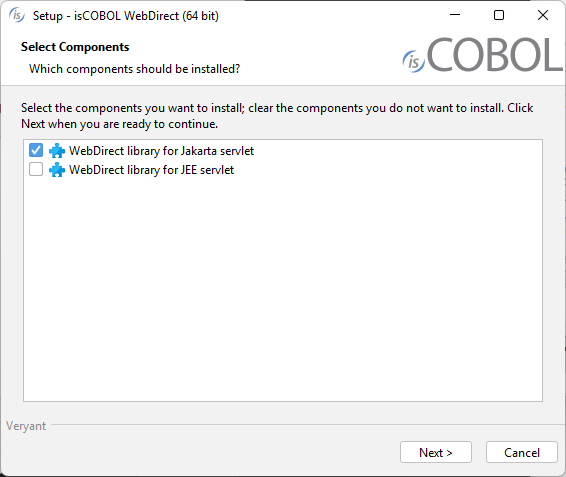
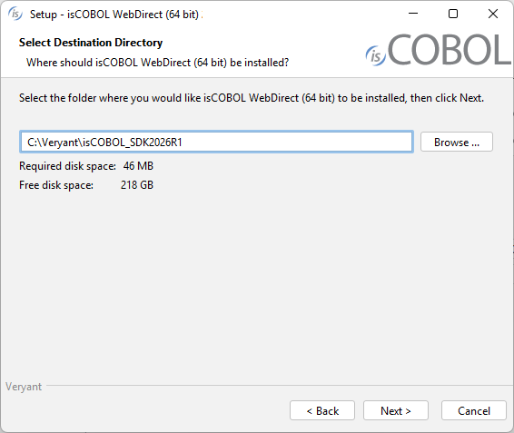

### Download and install isCOBOL WebDirect

#### Windows

1. If you haven't already done so, [Download and install isCOBOL EIS](./Download-and-install-isCOBOL-EIS) .
2. Go to ["https://support.veryant.com"](https://support.veryant.com).
3. Sign in with your User ID and Password.
4. Click on the "Download Software" link.
5. Scroll down to the list of files for Windows x64 64-bit. Select isCOBOL_2026_R1_*n*_WEBD_Windows.64.msi, where *n* is the build number and *arc* is the system architecture.
6. Run the downloaded installer to install the files.
7. Select the desired set of libraries when prompted.



- Install Jakarta servlet libraries if you’re going to work with a Jakarta servlet container (e.g. Tomcat 10);
- Install JEE servlet libraries if you’re going to work with a JEE servlet container (e.g. Tomcat 9 or previous);
- Install both items if you’re going to work with both kinds of servlet container.

8. Select the isCOBOL SDK where you want to add the WebDirect items.



##### Quiet mode

The isCOBOL WebDirect setup supports the msi quiet mode. Settings can be driven with a response file.

A response file is a text file with name-value pairs that represent installer variables.

A response file is generated automatically after an installation is finished. The generated response file is found in the .*install4j* directory of the isCOBOL SDK and is named *response.varfile*.

When an installer is executed, it checks whether a file with the same name and the .*varfile* extension can be found in the same directory and loads that file as the response file. For example, if an installer is named *foo_setup.msi* on Windows, the response file next to it has to be named *foo_setup.varfile*.

For more information about msi setups and their command line options, see [Microsoft Standard Installer Command-Line Options](https://docs.microsoft.com/en-us/windows/win32/msi/standard-installer-command-line-options).

#### Linux and Mac OSX

1. If you haven't already done so, [Download and install isCOBOL EIS](./Download-and-install-isCOBOL-EIS).
2. Go to ["http://support.veryant.com"](http://support.veryant.com).
3. Sign in with your User ID and Password.
4. Click on the "Download Software" link.
5. Scroll down, and select the appropriate .tar.gz file for the product and platform you require.
6. Extract all contents of the archive. For example,

on Linux 64 bit:

```cobol
gunzip isCOBOL_2026_R1_*_WEBD_Linux.64.x86_64.tar.gz
tar -xvf isCOBOL_2026_R1_*_WEBD_Linux.64.x86_64.tar
```

on Mac OSX:

```cobol
gunzip isCOBOL_2026_R1_*_WEBD_MacOSX.64.x86_64.tar.gz
   tar -xvf isCOBOL_2026_R1_*_WEBD_MacOSX.64.x86_64.tar
```

7. Change to the "isCOBOL2026R1" folder and run "./setup", you will obtain the following output:

```cobol
===============================================================================
 
                           isCOBOL EVOLVE Installation
                           For isCOBOL Release 2026R1
                        Copyright (c) 2005 - 2026 Veryant
 
===============================================================================
 
Install Components:
 
    [0] All products...................................... (no)
    [1] isCOBOL WebDirect.library.for.Jakarta.Servlet..... (yes)
    [2] isCOBOL WebDirect.library.for.JEE.Servlet......... (no)
 
Install Path:
    [P] isCOBOL parent directory: UserHome/veryant
 
[S] Start Install        [Q] Quit
 
==============================================================================
Please press [ 0 1 2  P Q ] 
```

8. (optional) Type "1", then press Enter if you wish to disable the installation of Jakarta libraries. These libraries are suitable for Jakarta servlet containers like Tomcat 10.
9. (optional) Type "2", then press Enter if you wish to enable the installation of JEE libraries. These libraries are suitable for JEE servlet containers like Tomcat 9 or previous.
10. (optional) Type "P", then press Enter to provide a custom installation path, if you don’t want to keep the default one.
11. Type "S", then press Enter to start the installation.

#### Distribution Files

The WebDirect items must be copied into the proper directory in order to be available to the web application. If you're using Tomcat, copy these items to the proper location according to the below table.

WebDirect is composed of:

| Name | Description | Location |
| --- | --- | --- |
| iscobol.css | WebDirect stylesheet | resources/css |
| iscobol.properties | Configuration file for the web application | WEB-INF/classes |
| iscobol.jar | isCOBOL Runtime Framework | WEB-INF/lib |
| iswd2.jar | isCOBOL WebDirect Implementation | WEB-INF/lib |
| barcode4j.jar<br>javassist.jar<br>xmlbeans-3.1.0.jar<br>openpdf-2.0.3v1.jar<br>poi-4.1.2.jar<br>poi-ooxml-4.1.2.jar<br>poi-ooxml-schemas-4.1.2.jar<br>zxing-core-1.7.jar | Additional isCOBOL libraries | WEB-INF/lib |
| bsh.jar<br>commons-codec.jar<br>commons-collections.jar<br>commons-fileupload.jar<br>commons-io.jar<br>commons-logging.jar<br>Filters.jar<br>flashchart.jar<br>gmapsz.jar<br>gson.jar<br>jackson-annotations.jar<br>jackson-core.jar<br>jackson-databind.jar<br>sapphire.jar<br>silvertail.jar<br>slf4j-api.jar<br>slf4j-jdk14.jar<br>timelinez.jar<br>timeplotz.jar<br>zcommon.jar<br>zel.jar<br>zhtml.jar<br>zk-bootstrap.jar<br>zk.jar<br>zkbind.jar<br>zkex.jar<br>zkmax.jar<br>zkplus.jar<br>zml.jar<br>zsoup.jar<br>zul.jar<br>zweb.jar | ZK Framework and its dependences | WEB-INF/lib |
| portlet.xml | ZK loader for ZUML pages | WEB-INF |
| web.xml | Deployment Descriptor. To configure servlets, listeners and an optional filter | WEB-INF |
| zk.xml | Configuration descriptor of ZK. This file is optional. If you need to configure ZK differently from the default, you could provide a file called zk.xml under the WEB-INF directory. | WEB-INF |

All the above files are installed in $ISCOBOL/webdirect.
