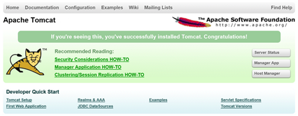
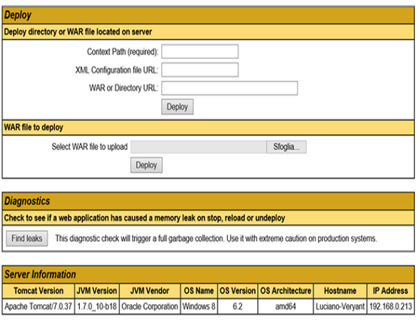
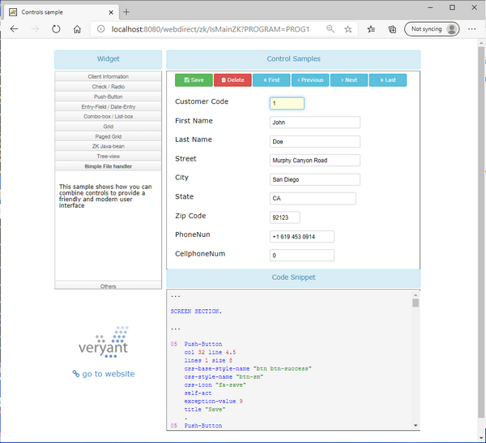

## Running the sample application

WebDirect comes with a sample web application. This chapter explains how to deploy and run the sample application.

### 1. Build the war

1. Change to the webdirect folder of isCOBOL samples

Windows

```cobol
cd %ISCOBOL%\sample\eis\webdirect\widget
```

Linux/Unix

```cobol
cd $ISCOBOL/sample/eis/webdirect/widget
```

2. Add zk.jar, zul.jar and zcommons.jar to the CLASSPATH

Windows

```cobol
set CLASSPATH=%CLASSPATH%;..\..\..\..\webdirect\lib\zk.jar;..\..\..\..\webdirect\lib\zul.jar;..\..\..\..\webdirect\lib\zcommon.jar
```

Linux/Unix

```cobol
export CLASSPATH=$CLASSPATH:../../../../webdirect/lib/zk.jar:../../../../webdirect/lib/zul.jar:../../../../webdirect/lib/zcommon.jar
```

3. Compile the programs

Windows

```cobol
iscc -sp=../../../isdef;copylib -wd2 *.cbl
```

Linux/Unix

```cobol
iscc -sp=../../../isdef:copylib -wd2 *.cbl
```

4. Create the "wd2" webapp folder structure as follows:

Windows

```cobol
mkdir webdirect
mkdir webdirect\arc
mkdir webdirect\excel
mkdir webdirect\pdf
mkdir webdirect\upload
mkdir webdirect\resources
mkdir webdirect\resources\css
mkdir webdirect\WEB-INF
mkdir webdirect\WEB-INF\classes
mkdir webdirect\WEB-INF\lib
mkdir webdirect\WEB-INF\programs
```

Linux/Unix

```cobol
mkdir webdirect
mkdir webdirect/arc
mkdir webdirect/excel
mkdir webdirect/pdf
mkdir webdirect/upload
mkdir webdirect/resources
mkdir webdirect/resources/css
mkdir webdirect/WEB-INF
mkdir webdirect/WEB-INF/classes
mkdir webdirect/WEB-INF/lib
mkdir webdirect/WEB-INF/programs
```

5. Copy the compiled programs and the sample files to the webapp folder as follows:

Windows

```cobol
copy %ISCOBOL%\sample\eis\webdirect\widget\css\custom.css webdirect\resources\css
copy %ISCOBOL%\sample\eis\webdirect\widget\images\* webdirect\WEB-INF\programs
copy %ISCOBOL%\sample\eis\webdirect\widget\snippet\* webdirect\arc
copy %ISCOBOL%\sample\eis\webdirect\widget\index.html webdirect
copy %ISCOBOL%\sample\eis\webdirect\widget\iscobol.properties webdirect\WEB-INF\classes
copy %ISCOBOL%\sample\eis\webdirect\widget\*.class webdirect\WEB-INF\programs
```

Linux/Unix

```cobol
cp $ISCOBOL/sample/eis/webdirect/widget/css/custom.css webdirect/resources/css
cp $ISCOBOL/sample/eis/webdirect/widget/images/* webdirect/WEB-INF/programs
cp $ISCOBOL/sample/eis/webdirect/widget/snippet/* webdirect/arc
cp $ISCOBOL/sample/eis/webdirect/widget/index.html webdirect
cp $ISCOBOL/sample/eis/webdirect/widget/iscobol.properties webdirect/WEB-INF/classes
cp $ISCOBOL/sample/eis/webdirect/widget/*.class webdirect/WEB-INF/programs
```

6. Copy the isCOBOL runtime and WebDirect libraries to the webapp lib folder as follows:

Windows

```cobol
copy %ISCOBOL%\webdirect\lib\*.jar webdirect\WEB-INF\lib
copy %ISCOBOL%\lib\commons-logging.jar webdirect\WEB-INF\lib
copy %ISCOBOL%\lib\commons-codec-*.jar webdirect\WEB-INF\lib
copy %ISCOBOL%\lib\javassist.jar webdirect\WEB-INF\lib
copy %ISCOBOL%\lib\iscobol.jar webdirect\WEB-INF\lib
copy %ISCOBOL%\lib\poi-*.jar webdirect\WEB-INF\lib
copy %ISCOBOL%\lib\xmlbeans-*.jar webdirect\WEB-INF\lib
copy %ISCOBOL%\lib\openpdf-*.jar webdirect\WEB-INF\lib
```

Linux/Unix

```cobol
cp $ISCOBOL/webdirect/lib/*.jar webdirect/WEB-INF/lib
cp $ISCOBOL/lib/commons-logging.jar webdirect/WEB-INF/lib
cp $ISCOBOL/lib/commons-codec-*.jar webdirect/WEB-INF/lib
cp $ISCOBOL/lib/javassist.jar webdirect/WEB-INF/lib
cp $ISCOBOL/lib/iscobol.jar webdirect/WEB-INF/lib
cp $ISCOBOL/lib/poi-*.jar webdirect/WEB-INF/lib
cp $ISCOBOL/lib/xmlbeans-*.jar webdirect/WEB-INF/lib
cp $ISCOBOL/lib/openpdf-*.jar webdirect/WEB-INF/lib
```

7. Copy deployment descriptors and the standard css file from the isCOBOL distribution to the webapp folders as follows:

Windows

```cobol
copy %ISCOBOL%\webdirect\css\iscobol.css webdirect\resources\css
copy %ISCOBOL%\webdirect\xml\*.xml webdirect\WEB-INF
```

Linux/Unix

```cobol
cp $ISCOBOL/webdirect/css/iscobol.css webdirect/resources/css
cp $ISCOBOL/webdirect/xml/*.xml webdirect/WEB-INF
```

8. Create the "wd2.war" with the following commands:

```cobol
cd webdirect
jar -cf webdirect.war *
```

**Note** - the above steps produce a war library that is suitable for Jakarta servlet containers (e.g. Tomcat 10). If you need to produce a war that is suitable for JEE servlet containers (e.g. Tomcat 9 or previous), refer to the README installed with the product.

### 2. Deploy the war

The following instructions are applicable to Apache Tomcat. However, your webapp can also be executed by other servlet containers.

Download Tomcat from [http://tomcat.apache.org/](http://tomcat.apache.org/) and install it, if you haven't installed it yet. Start the Tomcat service.

Note: if you're running Tomcat on Unix/Linux, ensure that the working directory is the Tomcat home directory. If you start the process from another directory (e.g. the Tomcat bin directory), then relative paths in the sample will not work.

When Tomcat service is started, open a browser and navigate to "http://127.0.0.1:8080/" . The browser displays something like:



Select *Tomcat Manager* link in order to application administration pages. You will be prompted for username and password. By default Tomcat has the user "admin" with no password. You can refer to *tomcat-users.xml*.

Using the Tomcat Web Application Manager, scroll down to the Deploy dialog and use the *Browse* button to select the Web Application Archive file (webdirect.war)



**Note** - By default the Tomcat Manager app doesn’t allow you to upload war files greater than 50 MB. Since webdirect.war is greater than 50 MB, you need to adopt one of the solutions explained in the Troubleshooting chapter of this book, at [Unable to deploy a war file whose size is greater than 50 MB](../Debug-and-Troubleshooting/Common-issues-in-EIS-environment#unable-to-deploy-a-war-file-whose-size-is-greater-than-50-mb).

An item called "webdirect" will be added to the Applications list.

Edit the file iscobol.properties in classes' folder to insert valid license codes. The following licenses are required:

- isCOBOL Runtime license (iscobol.license.2026)
- isCOBOL EIS license (iscobol.eis.license.2026)

To run the sample, open a browser and navigate to "http://127.0.0.1:8080/webdirect".


