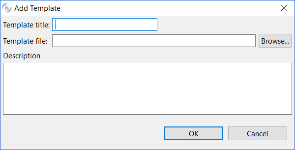

#### Loading Report Templates

```cobol
Preferences: isCOBOL -> Report Designer -> Templates
```

The Templates panel allow you to load previously exported Reports (\*.irl) in order to use them as template for the new reports that you will create in the project. Click on the "Add" button to make the following dialog appear:



Provide a name and an optional description for your template, then browse for the irl file.

See [Import / Export of Reports](../../../Screen-Programs/Import-Export-of-Screens) for information about how to produce a irl file.
