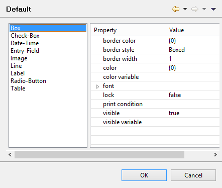

#### Setting Report defaults

```cobol
Preferences: isCOBOL -> Report Designer -> Default
```

The Report Designer / Default panel allows the user to configure default values for properties and styles that will be applied to graphical controls as soon as they’re drawn in the Report Designer.


