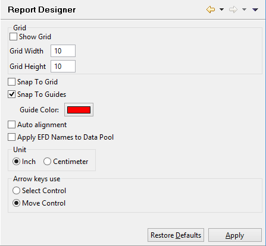

### Setting Report Designer preferences

```cobol
Preferences: isCOBOL -> Report Designer
```

The Report Designer panel allows you to enable and configure the grid on the background of each report you draw. When you create a report using the IDE, a grid made of dotted lines can be shown on the background to help you in placing and aligning the graphical controls. From this panel you can configure the size of the grid cells in pixels and you can activate the ‘Snap To Grid’ feature to make the IDE automatically align controls to cell boundaries.

Another feature that allows you to easily align controls is the ‘Snap To Guides’. With this feature enabled, when you drag a control over the report, guide lines will be shown on the X and Y axes allowing you to check if the current control position is on the same line or column of other controls.

From this panel you can also configure the behavior of arrow keys on selected controls and the mesaurement unit.


