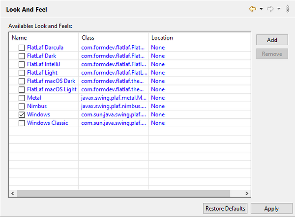

#### Setting the Look And Feel

```cobol
Preferences: isCOBOL -> Look And Feel
```

The “Look And Feel” panel allows the user to choose the Look and Feel that will be applied to the windows of the programs and the isCOBOL utilities run from the IDE.

The “Look And Feel” panel lists the LAFs that are available in the current virtual machine. Clicking on the 'Add' button pops up a dialog that allows you to choose a custom jar library with custom LAFs that will be added to the list making it available to the IDE.


