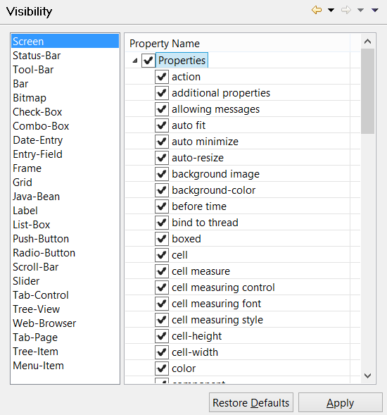

#### Setting property Visibility

```cobol
Preferences: isCOBOL -> Screen Designer -> Visibility
```

The “Visibility” panel allows you to choose which entries will appear in the Property list of each single control. This feature allows you to filter entries excluding the ones that you will never manage and making it easier to reach the ones you’re interested in.


