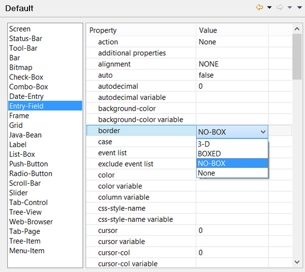

#### Setting Screen defaults

```cobol
Preferences: isCOBOL -> Screen Designer -> Default
```

The Screen Designer / Default panel allows the user to configure default values for properties and styles that will be applied to graphical controls as soon as they’re drawn in the Screen Designer. For example, if you want all text fields to be unboxed, you can set the NO-BOX style as default for the ENTRY-FIELD border instead of changing this setting in the [Properties](../../../The-isCOBOL-IDE-Perspective/Properties) view each time you draw a new ENTRY-FIELD.


