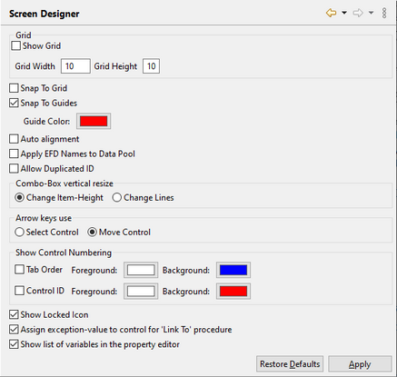

### Setting Screen Designer preferences

```cobol
Preferences: isCOBOL -> Screen Designer
```

The Screen Designer panel allows you to enable and configure the grid on the background of each screen you draw. When you create a screen using the IDE, a grid made of dotted lines can be shown on the background to help you in placing and aligning the graphical controls. From this panel you can configure the size of the grid cells in pixels and you can activate the ‘Snap To Grid’ feature to make the IDE automatically align controls to cell boundaries.

Another feature that allows you to easily align controls is the "Snap To Guides". With this feature enabled, when you drag a control over the screen, guide lines will be shown on the X and Y axes allowing you to check if the current control position is on the same line or column of other controls.

The "Combo-Box vertical resize" option configures the behavior of increasing the height of combo-box controls by dragging the mouse. This action can either increase the item height or increase the combo-box lines. This option is evaluated each time a new Screen Designer is opened, so changing it doesn’t affect those Screen Designers that are already open.

The "Show Locked Icon" option causes a lock icon to be shown on the bottom left of locked controls.

In this panel you can also configure the behavior of arrow keys on selected controls. By default, if you select a control on the screen designer and then press arrow keys, the control is moved. You can change this behavior in order to use the arrow keys to switch the selection to another control.

The "Assign exception-value to control for ‘Link To’ procedure" option causes an exception-value to be automatically assigned to every new button you draw. When this option is unchecked, the exception-value property of new buttons is left blank. You can always set or change the exception-value property in the [Properties](../isCOBOL%20IDE/Chapter1-isCOBOL_IDE.3.059.html#ww1216638 "Properties") view after the button has been drawn.

The "Show list of variables in the property editor" option allows you to disable the proposal of variable names in the Variables tab of the [Properties](../isCOBOL%20IDE/Chapter1-isCOBOL_IDE.3.059.html#ww1216638 "Properties") view. Disabling this proposal may help in having a more responsive UI when you’re editing programs that include hundreds of data items.


