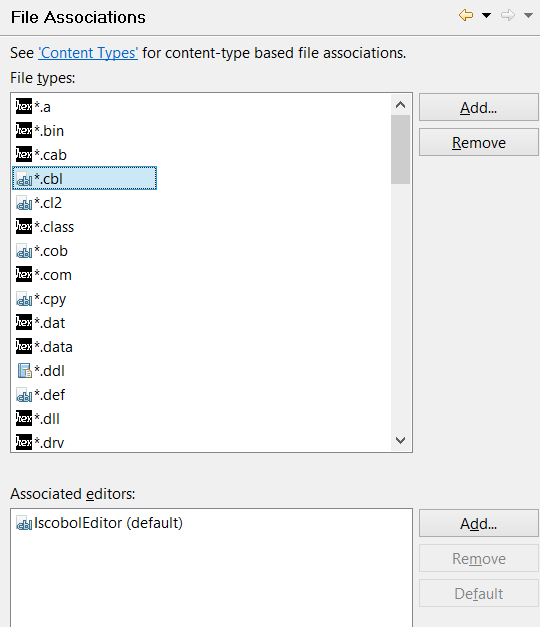

### Associating file types with the proper editor

```cobol
Preferences: General -> Editors -> File Associations
```

isCOBOL IDE includes different editors in addition to the COBOL editor. Different file types are associated with different editors. You can check and update these associations from the *File Associations* panel.



The editor is invoked each time you open a file from the [isCOBOL Explorer](../isCOBOL%20IDE/Chapter1-isCOBOL_IDE.3.043.html#ww1022875 "isCOBOL Explorer").

There can be one or more editors associated with each file type. Click on the *Add* and *Remove* buttons to create new associations or to remove an existing one.

Files that don’t have an associated editor are open through external programs provided by the operating system, outside of the IDE window.
