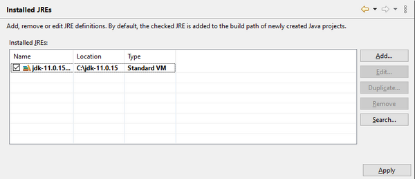

### Binding additional JRE

```cobol
Preferences: Java -> Installed JREs
```

isCOBOL IDE is uses the Java runtime of the JDK that was associated during the installation. It’s possible to link external JREs in order to run your programs with a different version of Java.



Click on the *Add* button and browse for the desired JRE main folder. The selected folder must include "bin" and "lib" subfolders where Java executables and libraries are found.

If the selected folder is recognized as a valid JRE, a new line appears in the table and you can now choose which JRE must be used. The choice made here is applied to every new project created in the workspace.
