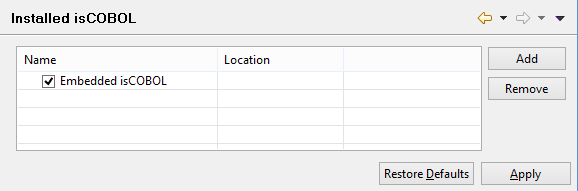

### Binding additional isCOBOL SDK

```cobol
Preferences: isCOBOL -> Installed isCOBOL
```

isCOBOL IDE embeds isCOBOL compiler and runtime libraries of the same version and bitness. It’s possible to link external isCOBOL SDKs in order to compile and run your programs with a different version of isCOBOL.



Click on the *Add* button and browse for the desired isCOBOL SDK main folder. The selected folder must include "bin" and "lib" subfolders where isCOBOL compiler and runtime libraries are found.

If the selected folder is recognized as a valid isCOBOL SDK, a new line appears in the table and you can now choose which isCOBOL SDK must be used. The choice made here is applied to every new project created in the workspace.

The isCOBOL SDK version must be 2017 R1 or greater. It’s not possible to link older isCOBOL SDKs.

Generally speaking, the backward compatibility between the current IDE and older SDKs is guaranteed, but the compatibility with older IDEs and recent SDKs is not always guaranteed. The following table lists the known issues that occur between specific versions of the IDE and specific versions of the isCOBOL SDK:

| IDE Version | SDK Version | Known issues |
| :--- | :--- | :--- |
| any | 2016 R1 or previous | These SDKs can't be bound to the IDE as they lack the necessary implementation. |
| 2019 R2 or previous | 2020 R1 or greater | This bound can't be completed at 100% due to a change in the SDK folders structure. <br> You will be able to run/debug with the external SDK, but when you compile, the IDE will still use embedded one. Also the version shown in the project tree will remain 2019 R2. |
| 2020 R1 or previous | 2020 R2 or greater | Due to the Debugger re-engineering, you have to add -g to the compiler options in order to debug correctly. |
