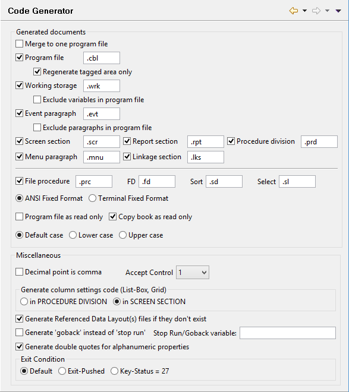

### Code Generation settings

```cobol
Preferences: isCOBOL -> Code Generator
```

The *Code Generator* panel allows you to configure the code generated by the IDE for Screen Programs.

In particular you can set:

- which parts of the program should be generated. By default the whole program is generated, but you could ask the IDE to generate just the Screen Section copybook or other single parts.

- the extension of the generated files.

- how many files should be generated. Here you can choose to have multiple copy files or one single source file.

- the output format. The IDE can generate code in "ANSI" and "Terminal" format.

- the text case. The IDE can be forced to generate all the code in lower-case or upper-case. This setting affects all the generated code except for the text between quotes, the method names, the code in the Event Paragraph section, the code outside the Tagged Areas and the comments.

- the DECIMAL-POINT Special Name. Flag the option to generate "DECIMAL-POINT COMMA" in the program Special-Names.

- where to generate column settings (e.g. DISPLAY-COLUMNS and DATA-COLUMNS) for Grid and ListBox. You can choose between having them in the SCREEN SECTION as control properties or in the PROCEDURE DIVISION as MODIFY statements.

- which statement will be generated for the program exit. Choose between "GOBACK" and "STOP RUN". You also choose a variable to be returned as program exit status (Stop Run/Goback variable); this variable will be added to the [Working Storage Designer](../isCOBOL%20IDE/Chapter1-isCOBOL_IDE.3.052.html#ww1022914 "Working Storage Designer") with a picture S9(10).

- the value to be moved to the Accept-Control special registry at the end of the Accept.

- if quotes should be generated for alphanumeric properties.

- if the ACCEPT cycle must exit when the EXIT-PUSHED condition name is true or when the KEY-STATUS data item is equal to 27.

**Note:** if you change the Source Format the IDE will ask you to regenerate all the programs in the workspace.

Code generation rules:

- When Program file is selected, and Regenerate tagged area only is not selected, isCOBOL IDE generates code for the program source file, replacing the existing cbl file.

- When both Program file and Regenerate tagged area only are selected, isCOBOL IDE generates code in the tagged portions of the program source file only. This preserves any code that you may have added outside of the tags. See [Code Editing](../isCOBOL%20IDE/Chapter1-isCOBOL_IDE.3.083.html#ww1023198 "Code Editing") for more details.

- When Working storage is selected, isCOBOL IDE generates the Working-Storage copy file.

- When both Working storage and Exclude variables in program file are selected, isCOBOL IDE does not generate Working-Storage items in the .wrk file for variables that are already declared in the program source file.

- When Event paragraph is selected, isCOBOL IDE generates the event paragraph copy file.

- When both Event paragraph and Exclude paragraphs in program file are selected, isCOBOL IDE does not generate paragraphs that are already included in the program source file, it assumes that a paragraph in the program file with the same name as a paragraph that could be generated in the .evt copy file suppresses the paragraph that could be generated.


