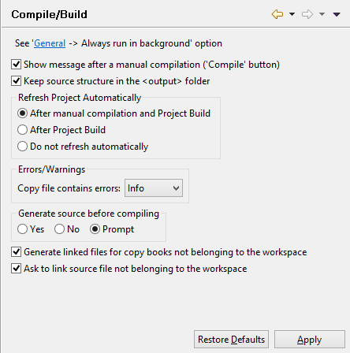

### Compile/Build settings

```cobol
Preferences: isCOBOL -> Compile/Build
```

When the IDE builds a project or just compiles a COBOL program it shows a message box that informs the user about the outcome. In this panel you can disable this message. Here it’s also possible to instruct the IDE to replicate source sub folders structure (if any) in the output folder.

You can also configure the frequency of project content refresh. By default, the IDE refreshes the project content after each compile and build. You can choose to refresh only after build or to never refresh automatically. Reducing the content refresh may increase performance.

The 'Copy contains errors' option specifies the severity of the corresponding entries in the 'Problems' view. When set to 'Error' or 'Warning' the icons of the related source programs in the 'File' view are marked with the Error/Warning decoration.

By default the IDE generates a linked copybook in the cpy folder for each copybook found via -sp compiler option whose path doesn't belong to the workspace. By unchecking the option 'Generate linked files for copy books not belonging to the workspace', you disable this automatic link.

When you compile the source code in the current editor, if the source doesn’t belong to any project, the IDE asks if you wish to add the file to a project. By unchecking the option 'Ask to link source file not belonging to the workspace', when you compile the source code in the current editor, if the source doesn’t belong to any project, the IDE shows an error.


