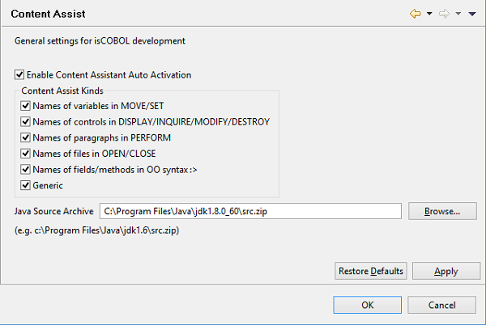

### Configuring the Content Assistant

```cobol
Preferences: isCOBOL -> Editor -> Content Assist
```



If *Enable Content Assistant Auto Activation* is checked (default) the Content Assistant is automatically shown while you’re editing the code. If the option is unchecked you will need to call the Content Assistant by pressing CTRL+SPACEBAR.

You can also choose which areas of the content Assistant should be activated.
