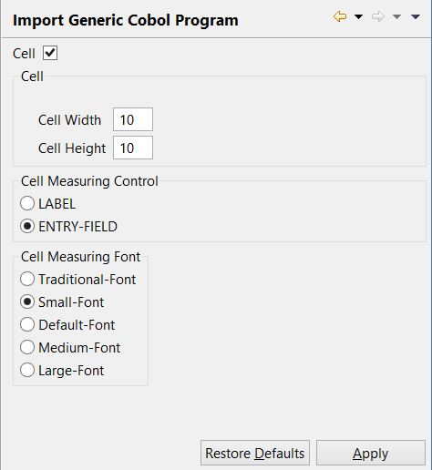

### Configuring the Import Generic COBOL Program Feature

```cobol
Preferences: isCOBOL -> Import Generic Cobol Program
```

In this dialog it’s possible to specify the cell measurement approach to be used when a generic COBOL program with Screen Section is imported in the IDE. See [Importing a Program with Screen Section](../isCOBOL%20IDE/Chapter1-isCOBOL_IDE.3.209.html#ww1214985 "Importing a Program with Screen Section") for further details about importing programs with Screen Section in the IDE.


