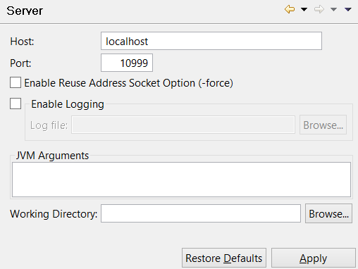
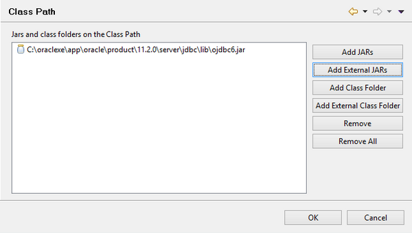
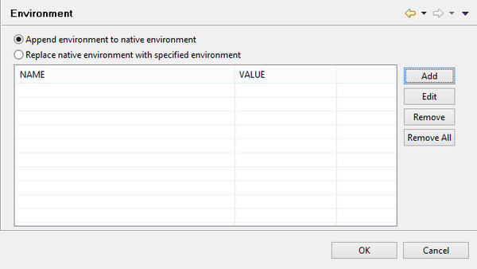
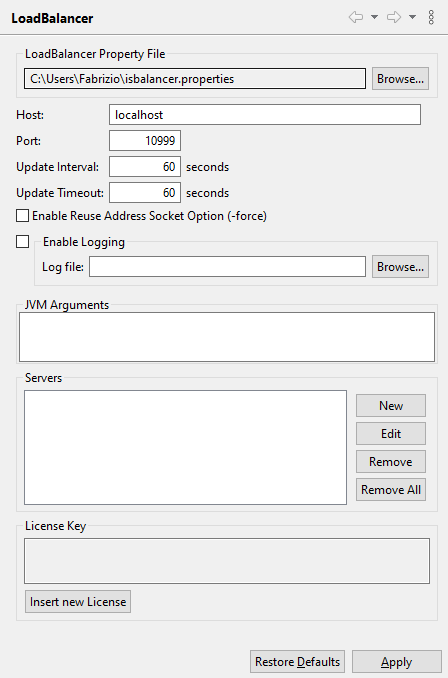
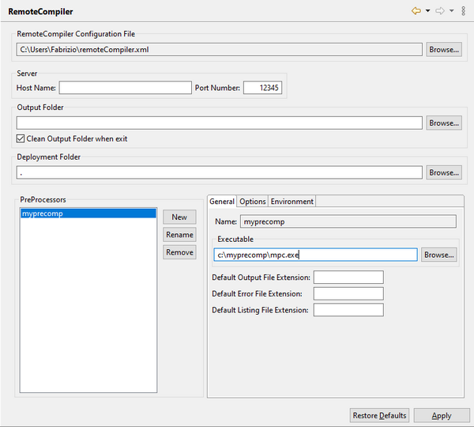

### Configuring isCOBOL Tools

#### isCOBOL Utilities Settings

```cobol
Preferences: isCOBOL -> Tools -> Index and Relative File Editor
```

These panels allow you to configure the Class Path and the Environment for the GIFE utility. See [Setting the Class Path](../isCOBOL%20IDE/Chapter1-isCOBOL_IDE.3.034.html#ww1195999 "Configuring isCOBOL Tools") and [Setting the Environment](../isCOBOL%20IDE/Chapter1-isCOBOL_IDE.3.034.html#ww1196012 "Configuring isCOBOL Tools") for details about the Class Path and Environment panels. This kind of setting is particularly useful in order to add JDBC driver libraries for the “easydb” file handler.

```cobol
Preferences: isCOBOL -> Tools -> Index File Migration
```

These panels allow you to configure the Class Path and the Environment for the ISMIGRATE utility. See [Setting the Class Path](./Configuring-isCOBOL-tools#setting-the-class-path) and [Setting the Environment](./Configuring-isCOBOL-tools#setting-the-environment) for details about the Class Path and Environment panels. This kind of setting is particularly useful in order to add JDBC driver libraries for the “easydb” file handler.

```cobol
Preferences: isCOBOL -> Tools -> isCOBOL Launcher
```

These panels allow you to configure the Class Path and the Environment for the ISL utility. See [Setting the Class Path](./Configuring-isCOBOL-tools#setting-the-class-path) and [Setting the Environment](./Configuring-isCOBOL-tools#setting-the-environment) for details about the Class Path and Environment panels. This kind of setting is particularly useful in order to add JDBC driver libraries for the “easydb” file handler.

```cobol
Preferences: isCOBOL -> Tools -> Java-Bean Copy Generator -> Class Path
```

This panel allows you to configure the Class Path for the cpgen command. See [Setting the Class Path](./Configuring-isCOBOL-tools#setting-the-class-path) for details about this panel.

```cobol
Preferences: isCOBOL -> Tools -> Jdbc2FD -> Class Path
```

This panel allows you to configure the Class Path for the JDBC2FD utility. It’s particularly useful in order to add JDBC driver libraries. See [Setting the Class Path](./Configuring-isCOBOL-tools#setting-the-class-path) for details about this panel.

#### isCOBOL Server Settings

```cobol
Preferences: isCOBOL -> Tools -> Server
```

The “isCOBOL Server” panel allows you to set options and parameters for the isCOBOL Server managed by the isCOBOL IDE.



The “Class Path” panel allows you to add jars and folders to the isCOBOL Server Class Path. The “Environment” panel allows you to set environment variables for the isCOBOL Server. See [Setting the Class Path](./Configuring-isCOBOL-tools#setting-the-class-path) for details about this panel.

#### Setting the Class Path



Use the "Add JARs" button to browse for a jar among project folders and add it to the Classpath.

Use the "Add External JARs" button to browse for a jar among system folders and add it to the Classpath.

Use the "Add Class Folder" button to browse for a folder in the project and add it to the Classpath.

Use the "Add External Class Folder" button to browse for a folder in the system and add it to the Classpath.

Use the "Remove" button to remove an item from the list.

Use the "Remove All" button to clean the list.

#### Setting the Environment



Use the "Add" button to define a new environment variable.

Use the "Edit" button to change the value of the selected variable.

Use the "Remove" button to remove a variable from the list.

Use the "Remove All" button to clean the list.

When the "Append environment to native environment" option is selected, the variables specified by the user plus the variables already defined in the system are included in the process environment. If a variable specified by the user is already defined in the system, its value is overridden.

When the "Replace native environment with specified environment" option is selected, only the variables specified by the user are included in the process environment.

The library path variable (PATH on Windows, LD\_LIBRARY\_PATH on Linux/Unix) is managed differently, as follows: if it is already defined in the process environment, either by the user or by the system, the isCOBOL native libraries location is appended to its value; if it is not defined, it is set to the isCOBOL native libraries location.

#### LoadBalancer Settings

```cobol
Preferences: isCOBOL -> Tools -> LoadBalancer
```

The “LoadBalancer” panel allows you to set options and parameters for the isCOBOL LoadBalancer managed by the isCOBOL IDE.



#### RemoteCompiler Settings

```cobol
Preferences: isCOBOL -> Tools -> RemoteCompiler
```

The “Remote Compiler” panel allows you to set options and parameters for the RemoteCompiler managed by the isCOBOL IDE.


