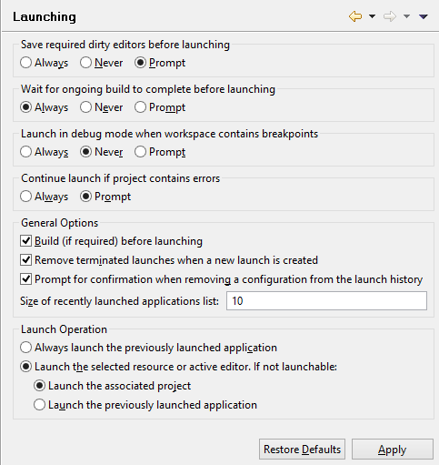

### Configuring launching preferences

```cobol
Preferences: Run/Debug -> Launching
```

The “Launching” panel allows you to configure the actions taken when a program is launched.

When you run or debug a program, if there are some unsaved editors, a message box appears asking if you want to save the editors before launch. Also, if the option *Build (if required) before launching* is checked, a build of the project is executed, so the modified source will be recompiled.

This behavior is identical with or without 'Build Automatically' set for the project, altough, when the 'Build Automatically' is active, whenever you save a source, the build starts automatically.


