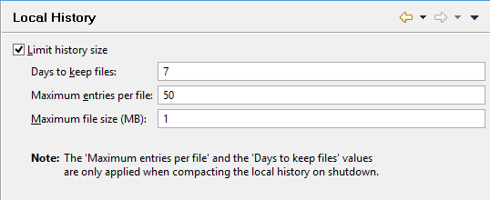

### Configuring the Local History

```cobol
Preferences: General -> Workspace -> Local History
```

The Local Histroy keeps track of modifications to the project items allowing to restore a previous version of the item. In this panel you can limit the size of the history. If “Limit history size” is disabled, the other settings are ignored and the Local History entries are saved indefinitely.



*Limit history size:* enables the limits to the History size (default enabled)

*Days to keep files:* when close and save the workspace, removes the entries older than ```<n>``` days (default 7 days).

*Maximum entries per file:* when close and save the workspace, maintains only the most recent ```<n>``` entries (default 50 entries).

*Maximum file size (MB):* set the maximum file size for which the 'Local History' feature is enabled (default 1 MB).
