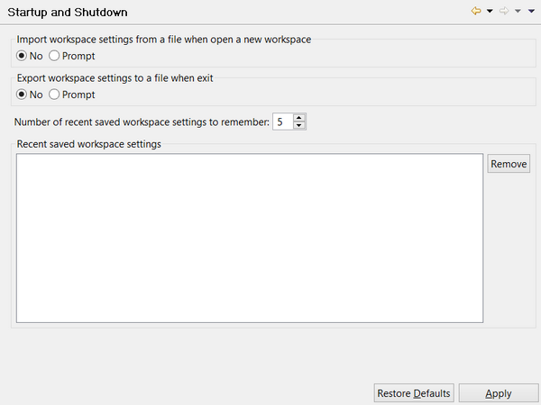

### Configuring Startup and Shutdown preferences

```cobol
Preferences: isCOBOL -> Startup and Shutdown
```

The “Startup and Shutdown” panel allows you to activate and deactivate the option to save workspace settings to a file when the workspace is closed and to load them when a new workspace is open. By default the IDE asks the user for the name of the file in which preferences are stored while opening or closing a workspace. To disable the feature, change the setting from “Prompt” to “No”.


