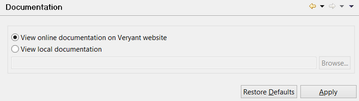

### Linking the isCOBOL documentation

```cobol
Preferences: isCOBOL -> Documentation
```

The “Documentation” panel allows you to choose which isCOBOL Documentation will be open from inside the IDE when you select *Open isCOBOL Documentation* in the *Help* menu. By default the IDE opens the online documentation available on Veryant’s website, which is the most up to date, however you can make it link to a local copy of the isCOBOL documentation if you prefer.


