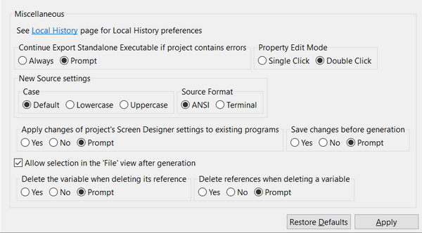

### Miscellaneous options

```cobol
Preferences: isCOBOL
```

Below the Java association, you can configure miscellaneous options.



By default you have to double click on a property value in the Screen Designer in order to edit it. If you prefer to use a single click, this is the place to configure it.

By default the IDE prompts you to save changes made on the screen before generating the source code. From this panel you can also choose if duplicated control IDs are allowed by the Screen Designer; by default, if you set the ID property of a control to a value that has already been used by another control ID, the IDE shows an error.

By default, the IDE automatically selects the generated source code after the code generation is complete. This will allow you to quickly compile your code without having to select it from the [isCOBOL Explorer](../isCOBOL%20IDE/Chapter1-isCOBOL_IDE.3.043.html#ww1022875 "isCOBOL Explorer") tree. If you wish to disable this feature, uncheck the option “Allow selection in the isCOBOL Explorer after generation”.

"Delete the variable when deleting its reference" and "Delete references when deleting a variable" allow you to avoid leaving useless items in the program when something is deleted. For example, if you delete a graphical control from the Screen Designer, you probably don’t need the variables that were associated with it, so it’s a good idea to delete them. By default the IDE always asks you what to do, but you can configure it to always delete referenced items or never delete referenced items without asking the user.
