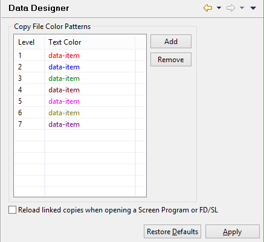

### Setting Data Designer options

```cobol
Preferences: isCOBOL -> Data Designer
```

When you import or link a copy file in the graphical Linkage Section, Working-Storage or File Designer, the content of the copy file is colored to easily distinguish it from the rest of the data items. Nested copy files are colored with different colors. This panel allows you to configure these colors.

After a copy file has been linked, if the user changes it with external editors, the IDE is not aware of the changes. You have to right click on the copy file and choose "Reload" in order to make the IDE aware of the changes. An alternate solution is to check the option "Reload linked copies when opening a Screen Program or FD/SL". In this way the IDE automatically reloads all the linked copy file each time you open the Screen Program or the FD in Structural or Data view respectively.


